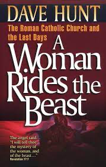
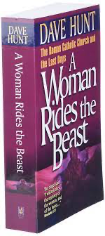
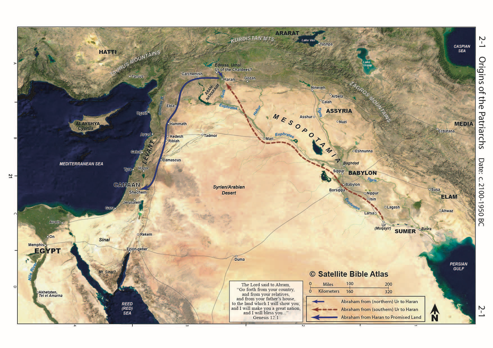
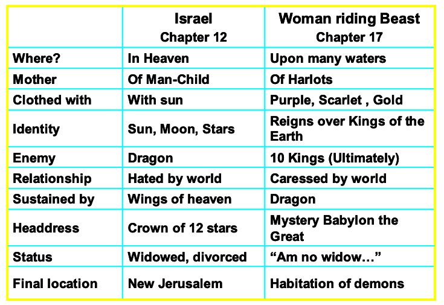



**Video**



## Revelation 17 -- the woman who rides the beast

<small> Then one of the seven angels who had the seven bowls came and said to me, "Come, I will show you the judgment of the great prostitute who is seated on many waters, with whom the kings of the earth have committed sexual immorality, and with the wine of whose sexual immorality the dwellers on earth have become drunk." And he carried me away in the Spirit into a wilderness, and I saw a woman sitting on a scarlet beast that was full of blasphemous names, and it had seven heads and ten horns. The woman was arrayed in purple and scarlet and adorned with gold and jewels and pearls, holding in her hand a golden cup full of abominations and the impurities of her sexual immorality. And on her forehead was written a name of mystery: "Babylon the great, mother of prostitutes and of earth's abominations." And I saw the woman, drunk with the blood of the saints, the blood of the martyrs of Jesus. When I saw her, I marveled greatly. But the angel said to me, "Why do you marvel? I will tell you the mystery of the woman, and of the beast with seven heads and ten horns that carries her. The beast that you saw was, and is not, and is about to rise from the bottomless pit and go to destruction. And the dwellers on earth whose names have not been written in the book of life from the foundation of the world will marvel to see the beast because it was and is not and is to come. This calls for a mind with wisdom: the seven heads are seven mountains on which the woman is seated; they are also seven kings, five of whom have fallen, one is, the other has not yet come, and when he does come he must remain only a little while. As for the beast that was and is not, it is an eighth but it belongs to the seven, and it goes to destruction. And the ten horns that you saw are ten kings who have not yet received royal power, but they are to receive authority as kings for one hour, together with the beast. These are of one mind, and they hand over their power and authority to the beast. They will make war on the Lamb, and the Lamb will conquer them, for he is Lord of lords and King of kings, and those with him are called and chosen and faithful." And the angel said to me, "The waters that you saw, where the prostitute is seated, are peoples and multitudes and nations and languages. And the ten horns that you saw, they and the beast will hate the prostitute. They will make her desolate and naked, devour her flesh and burn her up with fire, for God has put it into their hearts to carry out his purpose by being of one mind and handing over their royal power to the beast until the words of God are fulfilled. And the woman that you saw is the great city that has dominion over the kings of the earth."

</small>

## Introduction

God refers to idolatry as spiritual adultery. Following false gods is spiritually equivalent to engaging a prostitute. He applies this primarily to his unfaithful people (including Gentile believers, as we saw in the letters to Pergamum and Thyatira) and pagan nations.

-   Isaiah 26 portrays Tyre as a harlot: Isa 23:16 "Take a harp; go about the city, O forgotten prostitute! Make sweet melody; sing many songs, that you may be remembered."

-   Nahum also describes Nineveh as a harlot and a sorceress: Nah 3:4-5 And all for the countless whorings of the prostitute, graceful and deadly charms, who betrays nations with her whorings, and peoples with her charms. \[5\] Behold, I am against you, declares the LORD of hosts, and will lift up your skirts over your face; and I will make nations look at your nakedness and kingdoms at your shame.

-   Here in Revelation, the Harlot symbolism is both literal and figurative.

    -   She is described as a prostitute and a sorceress (Rev 18:23),

    -   She is also an agent of the system to entice others, which is idolatry.

    -   What is a harlot? Imitation love. False affection. Intimacy for hire. Both parties knowingly engage in deceit---the ultimate symbol of broken fidelity.

        -   Is there anything in your life that fits one or all of those definitions? A job? A habit? A possession? A person?

        -   Deu 23:2 "No one born of a forbidden union may enter the assembly of the LORD. Even to the tenth generation, none of his descendants may enter the assembly of the LORD.

        -   Whenever we enjoin with a harlot (literal or figurative), we "father" or "give birth to" an illegitimate offspring that interferes in our relationship with God. Just as Jesus makes a way for one who was literally born of a forbidden union, He can cleanse all our forbidden works and make us right with God.

### Whom does the woman represent?

-   Fairly or unfairly, protestants have equated the woman of Revelation 17 to the Catholic Church.

    -   The Church has a sordid history of blood, is based in Rome, and features scarlet and purple in its pageantry.

    -   Dave Hunt -- a woman rides the beast dives into this -- while it's a fascinating read into the inner workings of the Catholic Church, I'm not sure we can conclude that's whom John had in mind!

 

    -   As with the Church at Sardis that had nothing good said about it, Protestants who see the whore of Babylon as the Catholic church might be interested to know that she is also described as the "mother of all harlots." The protestant church was born directly from the Catholic church.

-   Others see America as we are the world's chief exporter of all that God hates.

    -   Some people even refer to the American system (commercial and political) as "Babylon." The epitaph is justified.

-   Of course, such views would not have occurred to John or his audience as neither the Catholic Church nor America existed in the 1st century.

-   As is our custom, while we may point out some similarities to our day, we will primarily stick to letting the Bible interpret Revelation instead of current events.

-   God, Himself, may reassign the symbolism of Babylon to America, the Catholic Church, or some other entity when all this goes down; until then, we need to tread lightly.

-   The first-century audience would have known Babylon was a pseudonym for Rome. Verse 18 tells us that the woman is the city. The beast she rides is the system behind the city.

    -   Peter likely used Babylon in the same way. It is more likely that the person he's referring was in Rome and not in the Iraqi desert (although Babylon at that time did have a substantial Jewish population).

    -   1 Pe 5:13 She who is at Babylon, who is likewise chosen, sends you greetings, and so does Mark, my son.

-   Isaiah 13, 14 and Jeremiah 50, 51 should be required pre-reading on Babylon before reading Revelation 17, 18.

    -   Jeremiah 51:7 is a crucial verse that will run throughout Revelation 17

    -   Jer 51:7 Babylon was a golden cup in the LORD's hand, making all the earth drunken; the nations drank of her wine; therefore the nations went mad.

### Babylon History

 

-   Babylon is mentioned over 300 times in the Bible, often contrasted with Jerusalem -- the city of the harlot versus the city of God (even though Jerusalem is sometimes called a harlot, it is still the city chosen by God).

-   It is mentioned three times in Christ's genealogy.

-   It was the capital of the 1st World Dictator and will also be the capital of the last World Dictator.

-   Founded by Nimrod, "a mighty hunter *in defiance of* the Lord (Genesis 10); ill-fated Tower of Bab-el (Gate of God or Gateway to God).

    -   (compare languages scattered at Bab-el to all understanding one language in Acts 2 -- interesting that Georgia Guidestones referenced a single universal language)

    -   In other words, Babel was man's vain attempt to reach God.

    -   The goal was a sacred city that could challenge heaven.

    -   In contrast with Jerusalem, a city whose builder and maker is God (Heb 11:10)

    -   Although the tower is gone, the Babylonian religious system is still with us today.

    -   Our modern horoscope has its roots in ancient Babylon.

-   Around 1900 BCE, Abraham was called from Ur of the Chaldees.

-   Scholars have postulated two (sometimes three) possible locations for the "Ur of the Chaldees" from where God called Abram.

    - The northern conjecture would place it in northwest Syria near Haran. Interestingly, most Jewish tradition places Abraham here.

    -   The southern conjecture would place it around Babylon.

    -   Chaldea later became known as the general region of southern Mesopotamia, but it is not certain that this is the term's meaning as used in Genesis 11:28, 31.

-   In any case, Abraham (at the time an idol-worshipping gentile) was called out of Mesopotamia to Israel, setting up the contrast of Israel versus the gentile nations, the capital of which is Ur/Babylon

    -   Hammurabi was likely a contemporary of Jacob, and Joseph was a king of the First Babylonian Dynasty. He is known for his famous law code, which parallels the Mosaic law in many respects.

<!-- -->

-   Through the time of the Kings of Judah, Babylon was a minor administrative center of Assyria through the mid-600s when it started aspiring for independence.

-   Until then, Assyria to the north and Egypt to the south were the heavy hitters (and keep in mind Israel sandwiched between these giants of the ancient world along the great international highway).

-   Nabopolassar and his son Nebuchadnezzar attacked Nineveh in 612 BCE and destroyed it.

-   After this, a remnant of Assyrian forces allied with Egypt and Pharoah Neco II's forces marched northward to come to the aid of their new ally.

    -   Along the way, for reasons historians don't fully understand, good king Josiah decided to pick a fight with the Egyptians at Megiddo in 609. This was not a wise move as Judah now became a vassal state to Egypt (albeit for a relatively short period).  We can read about this in  2 Chr 35:20-24 
-   Nebuchadnezzar would ultimately defeat Pharoah Neco at the famous battle of Carchemish in 605.

-   He also laid siege to Jerusalem three times.
    -   The first was right after the battle of Carchemish. This resulted in King Jehoiakim being forced to pay tribute.
    -   The second was in 597 BCE, which was the first deportation. This siege occurred because Jehoiakim refused to pay tribute. Jehoiakim was executed, and Jehoiachin took his place. He was also known as Jeconiah or Coniah in the Bible. During the first deportation, the elite was sent to Babylon, including Daniel and his three friends.;
    -   The third siege was in 587/586, which destroyed the 1st temple and the 2nd deportation.
        -   The destruction of the temple in 586 was a watershed moment in Judah's history. It seemed God's promises had failed. The people grappled with cognitive dissonance as everything they had been taught about being God's chosen and blessed people was not at odds with reality.
    -   A third deportation also occurred in 582.
-   Nebuchadnezzar died in 562, and there were three kings with relatively short terms until Nabonidius took over in 553. 
-   Historical records show Belshazzar, who was Nebuchadnezzar's grandson, was either a vice-regent or perhaps a co-regent.
-   Daniel chapter 5 tells the story of the fall of Babylon at the hands of Cyrus and the Persians. This is the famous "handwriting on the wall" episode.
    -   As Daniel 5 recounts, that night, the Persians diverted the Euphrates and could enter Babylon without much resistance. Belshazzar was also killed that very night.
    -   Missler says that the residents of Babylon weren't aware they had been conquered for several days. Therefore, this is the FALL of Babylon, not the DESTRUCTION of Babylon that is prophesied in the Bible. The destruction is still in the future. Babylon has never been destroyed.
    - The main points of the conquest as told by Daniel are confirmed by the Steele of Cyrus, which is on display in the British Museum today.
    -   As a testimony to his character, Daniel, by now an elderly man, ascended again to administrative leadership in the Persian empire and was a friend to Darius much the same as he was a friend to Nebuchadnezzar.
    -   Missler pointed out that only two men (besides Jesus) of whom no sin is recorded in the Bible. Joseph and Daniel. Chuck added, "and both were senior executives." He said this with a wink in his eye because Chuck was himself a Fortune 500 CEO/senior executive before transitioning to vocational ministry!

### Comparisons of Babylon to Rome

-   There are some reasons why Babylon would make a good "code name" for Rome:
-   Both empires are the opposite (and opposed to) the Kingdom of Heaven, an "anti-kingdom" to go along with the "anti-Christ."
-   Both empires destroyed Jerusalem.
-   Both empires destroyed the Jewish Temple.
-   Both empires carried the Jewish people into exile.

> So if one wanted to refer to Rome in an environment where speaking out against Rome directly was illegal, Babylon would have been an easily understood substitute..

-   One last preliminary comment: several outlines consider chapter 17 to begin the final section of Revelation. 17/18 -- Mystery Babylon; 19- The return of the King, 20, the Millenium, 21-Eternity, 22-Conclusion.

### Rev 17:1-2

<small>1 Then one of the seven angels who had the seven bowls came and said to me, "Come, I will show you the judgment of the great prostitute who is seated on many waters, with whom the kings of the earth have committed sexual immorality, and with the wine of whose sexual immorality the dwellers on earth have become drunk."</small>

-   Isa 1:21 How the faithful city has become a whore, she who was full of justice! Righteousness lodged in her, but now murderers.

-   Rome dominated the lands around the Mediterranean sea.

-   "Waters" or "sea" often equals "nations."

    -   Rev 14:8 Another angel, a second, followed, saying, "Fallen, fallen is Babylon the great, she who made all nations drink the wine of the passion of her sexual immorality."

-   Any local ruler or magistrate could have been called a "king" in the roman empire even though they were subservient to Rome.

-   Jeremiah 51:7 Babylon was a golden cup in the LORD's hand, making all the earth drunken; the nations drank of her wine; therefore the nations went mad.

-   Although referenced here, the actual judgment occurs in our Chapter 18

    -   Chapter breaks are man's insertions

        -   If time were no object, we would study chapters 16-19, along with Isaiah 13-14 and Jeremiah 50-51, in one sitting.

### Rev 17:3

<small>3 And he carried me away in the Spirit into a wilderness, and I saw a woman sitting on a scarlet beast that was full of blasphemous names, and it had seven heads and ten horns.</small>

-   Dan 7:24 As for the ten horns, out of this kingdom, ten kings shall arise, and another shall arise after them; he shall be different from the former ones and shall put down three kings.

-   John is "in the Spirit," as in Chapter 1. We contrast John's being carried to heaven previously but to a wilderness here.

-   For God's people, a biblical wilderness is a place of tempting, testing, and, ultimately, God's provision (Revelation 12:14)

-   Here, John appears to be saying that the harlot thinks she is ruler over many waters but is in a barren, desolate wilderness.

-   A beast, the she-wolf, is said to have sustained the twins Romulus and Remus in their infancy before the founding of Rome.

-   Blasphemous names might have referred to the Roman Emperor's desire to be worshipped, as in, "my Lord, my God, Domitian."

-   A first-century audience might have associated the seven heads with the first seven emperors (Julius Caesar through Vespasian, excluding the three short-term leaders in 68-69), but more likely with the four beasts of Daniel 7 that have a total of seven heads and ten horns.

-   This imagery is repeated from Rev 12:3-4 and Rev 13:1-8

    -   Rev 13:1 And I saw a beast rising out of the sea, with ten horns and seven heads, with ten diadems on its horns and blasphemous names on its heads.

-   Many see the woman as symbolic of the beast's false religious system (we will view the false commercial system in Chapter 18). If so, this is a state-run religion. We would be wrong if we think we don't have this in America. We are now reaping the results of 40 years of enforced paganism in our public schools and are now at a place where our 1st and second graders are being educated on sexually explicit matters.

### Rev 17:4

<small>4 The woman was arrayed in purple and scarlet and adorned with gold and jewels and pearls, holding in her hand a golden cup full of abominations and the impurities of her sexual immorality.</small>

-   "Golden cup" is an overt allusion to Jer 51:6-8 "Flee from the midst of Babylon; let every one save his life! Be not cut off in her punishment, for this is the time of the LORD's vengeance, the repayment he is rendering her. Babylon was a golden cup in the LORD's hand, making all the earth drunken; the nations drank of her wine; therefore the nations went mad. Suddenly Babylon has fallen and been broken; wail for her! Take balm for her pain; perhaps she may be healed.

-   Rev 18:3 For all nations have drunk the wine of the passion of her sexual immorality, and the kings of the earth have committed immorality with her, and the merchants of the earth have grown rich from the power of her luxurious living."

-   Scarlet probably has multiple meanings, including the blood of the martyrs (as we shall see in verse 6) and the color red's long-standing association with prostitutes who wore red and purple to attract attention.

    -   Purple and scarlet required expensive dyes and communicated the wealth and "importance" of the person who wore them.

    -   Purple was the predominant color of Rome.

    -   We also contrast the woman clothed in earthly splendor with the woman of chapter 12, the heavenly woman clothed in white.

-   Remember the possibility that in chapters 17-18, we are "circling back" on chapters 13-16 for a different viewpoint.

    -   Rev 18:6 Pay her back as she herself has paid back others, and repay her double for her deeds; mix a double portion for her in the cup she mixed.

    -   The seven bowls were cups of wrath. Revelation 14:10 and Revelation 16:9

-   In verse 18, we are told that the woman is a literal city (presumably Rome). At the same time, the beast on which she rides is the imperial power of Rome -- the religious, political, and economic system.

    -   Rome was very wealthy.

    -   Missler sees literal Babylon on the banks of the Euphrates as rising again; others see a revised Rome/Roman Empire. The fictional Left Behind series imagined a blending of these two, with the Revived Roman empire having a significant administrative center in literal Babylon in Iraq.

    -   As neither Rome nor Babylon is of much global significance today, it's hard to visualize either being the center of a world empire; but things can change quickly.

    -   We'll have to watch and see!

### Rev 17:5

<small>5 And on her forehead was written a name of mystery: "Babylon the great, mother of prostitutes and of earth's abominations."</small>

-   Rev 14:8 Another angel, a second, followed, saying, "Fallen, fallen is Babylon the great, she who made all nations drink the wine of the passion of her sexual immorality."

-   "Mother of" has been used throughout the ages to denote an exponential extreme.

-   Not just a bomb, but the mother of all bombs. Not just a prostitute but the mother of all prostitutes.

-   Of all the harlots that have ever been, Babylon is the most terrible of them all.

-   In ancient cultures, a modest woman's head would have been covered, so the fact that the harlot's forehead is visible at all is offensive.

-   We also have the "forehead" theme continued.

    -   The mark of the beast is on the forehead or the right hand, as is the seal of the redeemed,

    -   In Deuteronomy 6:8, we are commanded to bind God's words to our hands and to let His words be as "frontlets to our eyes."

    -   Rev 22:4 They will see his face, and his name will be on their foreheads.

-   The immediate application is presumed that John used the term "Babylon" to avoid Roman censors, just as Peter did.

### Rev 17:6

<small>6 And I saw the woman, drunk with the blood of the saints, the blood of the martyrs of Jesus. When I saw her, I marveled greatly.</small>

-   Of the major ancient empires, Rome had a peculiar thirst for blood.

-   Roman entertainment and forms of punishment were notoriously violent (and often, the two were mixed with criminals and slaves slaughtered as sport for the masses).

-   Since Christians were criminals under Nero and Domitian, they provided an ample supply of victims.

-   Like Daniel before him, John wondered what the significance was of what he saw.

### Rev 17:7-8

<small>7 But the angel said to me, "Why do you marvel? I will tell you the mystery of the woman, and of the beast with seven heads and ten horns that carries her. 8 The beast that you saw was, and is not, and is about to rise from the bottomless pit and go to destruction. And the dwellers on earth whose names have not been written in the book of life from the foundation of the world will marvel to see the beast because it was and is not and is to come.</small>

-   Was, is not, and is to come" is a parody of the eternal God

-   Rev 1:4 John to the seven churches that are in Asia: Grace to you and peace from him who is and who was and who is to come, and from the seven spirits who are before his throne.

-   One possible application from Dr. Stern:

    -   The beast who was: Antiochus IV, who outlawed Judaism, enforced paganism, and desecrated the temple by sacrificing a pig to Zeus in the Holy of Holies.

    -   The beast who is not: as evil as Domitian is, he's not the anti-Christ, but he and Nero come from the same source as the others.

    -   The beast is to come -- the actual anti-Christ who will be worse than Antiochus IV but ultimately be destroyed (in Rev 20).

-   Seven heads and ten horns is a combination of the four beasts of Daniel 7 we looked at previously. The end-times revived empire will be worse than all the previous empires combined.

-   John may have marveled, but those not written in the book of life (the "earth dwellers") will marvel more.

### Rev 17:9-11

<small>9 This calls for a mind with wisdom: the seven heads are seven mountains on which the woman is seated; they are also seven kings, five of whom have fallen, one is, the other has not yet come, and when he does come he must remain only a little while. As for the beast that was and is not, it is an eighth but belongs to the seven and goes to destruction.</small>

-   This is a key to apocalyptic literature -- the symbols don't have to refer to just one thing.

-   The seven crowns are the seven hills of Rome and the kings at the same time.

-   Rome celebrated the fact that it stood on seven hills -- there was even a pagan festival called Septimontium for the seven mountains/hills.

-   Connecting the Roman emperors to the seven kings is not as straightforward as it might seem.  
-  The “other has not yet come” statement rules out Nero and Domitian because they had come.  There have been bad dudes on the scene but none so bad as Antiochus until we get to Hitler, and we can look in the rear-view mirror and conclude that Hitler was not the one who had not yet come.  We assume that the original audience understood the verses.
    -   A hallmark of apocalyptic literature is that it is flexible in application -- often, we do not know what the prophecy referred to until AFTER the thing has come to pass.

    -   It is just as plausible (given the 2000 years since Revelation was written) that all seven kings plus one are yet future.

-   Mountains, in biblical symbolism, represent power and governments.

-   Another view: seven kings -- five are fallen (Egypt, Assyria, Babylon, Persia, Greece), one is (the ancient Roman Empire), one is not yet (the revived Roman empire (or related one-world government)). The 8th of the 7th is potentially when Satan takes direct control over the 7th empire.

-   We don't want to tell you what to think; we want to get you TO think.

### Rev 17:12-13 -- Ten Horns

<small>12 And the ten horns that you saw are ten kings who have not yet received royal power, but they are to receive authority as kings for one hour, together with the beast. 13 These are of one mind, and they hand over their power and authority to the beast.</small>

-   "they have not yet received royal power" in other words, speculation will be futile.

-   This refers to Daniel 7:24. As for the ten horns, out of this kingdom, ten kings shall arise, and another shall arise after them; he shall be different from the former ones and put down three kings.

-   Verse 14 tells us that these are the kings of the east that cross the Euphrates on dry land and come to make war against God and gather at Megiddo.

-   In one sense, the identities of these kings are irrelevant. Their conspiracy against God is short-lived and will come to nothing, as we saw in Chapter 16.

### Rev 17:14

<small>14 They will make war on the Lamb, and the Lamb will conquer them, for he is Lord of lords and King of kings, and those with him are called and chosen and faithful."</small>

-   Keener notes that the Parthian King in that day referred to himself as "king of kings"; however, Christian and Jewish audiences rightfully applied these titles to God.

-   Deut 10:17 For the LORD your God is God of gods and Lord of lords, the great, the mighty, and the awesome God, who is not partial and takes no bribe.

### Rev 17:15-16

<small>15 And the angel said to me, "The waters that you saw, where the prostitute is seated, are peoples and multitudes and nations and languages. 16 And the ten horns that you saw, they and the beast will hate the prostitute. They will make her desolate and naked, and devour her flesh and burn her up with fire,</small>

-   Jer 51:11-14 "Sharpen the arrows! Take up the shields! The LORD has stirred up the spirit of the kings of the Medes because his purpose concerning Babylon is to destroy it, for that is the vengeance of the LORD, the vengeance for his temple.\[12\] "Set up a standard against the walls of Babylon; make the watch strong; set up watchmen; prepare the ambushes; for the LORD has both planned and done what he spoke concerning the inhabitants of Babylon. \[13\] O you who dwell by many waters, rich in treasures, your end has come; the thread of your life is cut. \[14\] The LORD of hosts has sworn by himself: Surely I will fill you with men, as many as locusts, and they shall raise the shout of victory over you.

-   Eze 16:37 therefore, behold, I will gather all your lovers with whom you took pleasure, all those you loved and all those you hated. I will gather them against you from every side and will uncover your nakedness to them, that they may see all your nakedness.

-   Eze 23:35 Therefore thus says the Lord GOD: Because you have forgotten me and cast me behind your back, you yourself must bear the consequences of your lewdness and whoring."

-   Isa 8:5-8 The LORD spoke to me again: \[6\] "Because this people has refused the waters of Shiloah that flow gently, and rejoice over Rezin and the son of Remaliah, \[7\] therefore, behold, the Lord is bringing up against them the waters of the River, mighty and many, the king of Assyria and all his glory. And it will rise over all its channels and go over all its banks, \[8\] and it will sweep on into Judah, it will overflow and pass on, reaching even to the neck, and its outspread wings will fill the breadth of your land, O Immanuel."

-   As we looked at before, the Medes & Persians conquered Babylon in Daniel 5.

    -   We say conquered, but they were more guilty of letting their guard down.

    -   Rome wasn't conquered by an external threat so much as it disintegrated from within.

    -   This weakness allowed the Vandals, Goths, etc., to move in and take over.

-   Nero himself is rumored to have burned Rome as a false flag to blame on Christians. Thus the Romans should have been smarter than to embrace a second Nero.

-   After their defeat at the Valley of Jehoshaphat, these survivors of the armies of Gog and Magog will turn their fury against Babylon.

-   Death by fire is rarely mentioned as a punishment in the Torah; however, where it is mentioned is curious as it references a daughter of a priest who plays the harlot:

    -   Lev 21:9 And the daughter of any priest, if she profanes herself by whoring, profanes her father; she shall be burned with fire.

    -   Burned by fire is also referenced in Rev 18:8.

### Rev 17:17

<small>17 for God has put it into their hearts to carry out his purpose by being of one mind and handing over their royal power to the beast until the words of God are fulfilled.</small>

-   This becomes a thorny theological issue of whether God entices people to sin. To do so would seem out of character since He is not willing that any should perish, but all come to repentance.

-   1 Kings 22:23 says the "Lord has put a lying spirit in the mouth of all these your prophets."; if we read the passage carefully, we see that God has convened a council where an apparent angel suggests that he, the angel, go out and be the lying spirit. God isn't the lying spirit Himself, but he permits it.

-   Romans 1 says that God "gives people over" to their sin, meaning He lets people continue along their path.

-   I believe that is what is in view here. These people were bent on rebellion, so God gave them over to follow the beast.

-   In so doing, they will unwittingly contribute to the destruction of the Beast, which God has prophesied.

-   God is sovereign and can use the wicked to accomplish His purposes.

### Rev 17:18

<small>18 And the woman that you saw is the great city that has dominion over the kings of the earth."</small>

-   The Great City often means Jerusalem; however, it is undoubtedly Rome in this context.

-   Jerusalem is hilly but not known as the city that sits on seven hills, and no one ruling in the world was subservient to Jerusalem.
-   Rome, however, had both aspects
- The "City on seven hills" usually refers to Rome; however, a surprising number of notable world cities that might bear some semblance to a figurative Babylon make that claim.  
- They include Washington, D.C. (built on Capitol Hill, Meridian Hill, Floral Hills, Forest Hills, Hillbrook, Hillcrest, and Knox Hill), Mecca, Tehran, San Francisco, Seattle, and Moscow.

### Woman Comparison

Remember, the harlot is not the beast itself, but it rides upon the beast. In other words, it is yoked to the beast. She initially exploits the beast but is eventually destroyed by it.

> We'll look at chapter 18 and the ultimate fall of Babylon next time.

