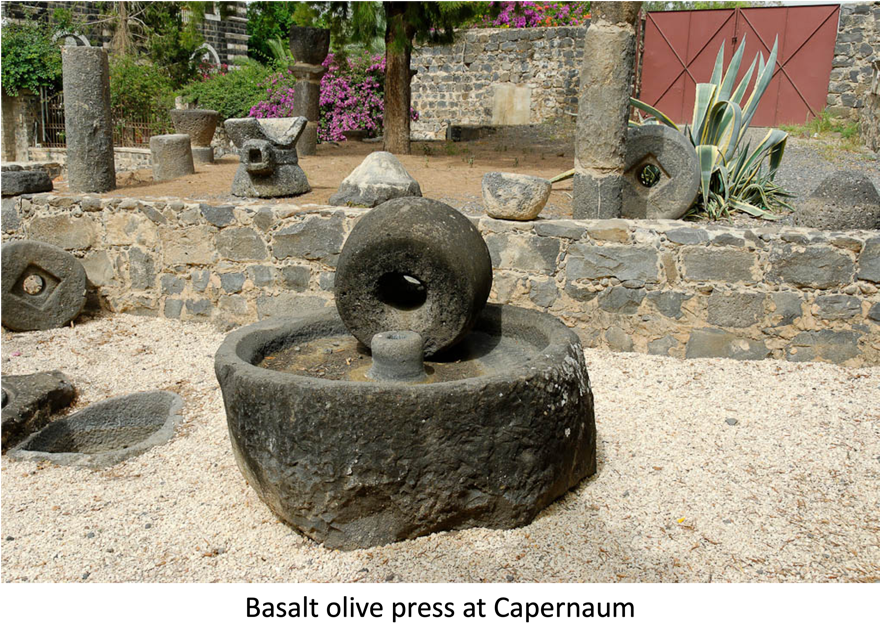



**Video**



## Revelation 18 -- Babylon has Fallen!

<small>After these things, I saw another angel coming down from heaven. He had great authority, the earth was lit up by his splendor. He cried out in a strong voice, "She has fallen! She has fallen! Bavel the Great! She has become a home for demons, a prison for every unclean spirit, a prison for every unclean, hated bird. "For all the nations have drunk of the wine of God's fury caused by her whoring---yes, the kings of the earth went whoring with her, and from her unrestrained love of luxury the world's businessmen have grown rich." Then I heard another voice out of heaven say: "My people, come out of her! so that you will not share in her sins, so that you will not be infected by her plagues, for her sins are a sticky mass piled up to heaven, and God has remembered her crimes. "Render to her as she rendered to others! Pay her back double for what she has done! Use the cup in which she has brewed to brew her a double-sized drink! "Give her as much torment and sorrow as the glory and luxury she gave herself! For in her heart she says, 'I sit a queen---I am not a widow, I will never see sorrow.' "Therefore, her plagues will come in a single day---death, sorrow and famine; and she will be burned with fire, because Adonai, God, her Judge, is mighty" The kings of the earth who went whoring with her and shared her luxury will sob and wail over her when they see the smoke as she burns. Standing at a distance, for fear of her torment, they will say, "Oh no! The great city! Bavel, the mighty city! In a single hour your judgment has come!" The world's businessmen weep and mourn over her, because no one is buying their merchandise any more--- stocks of gold and silver, gems and pearls, fine linen and purple, silk and scarlet, all rare woods, all ivory goods, all kinds of things made of scented wood, brass, iron and marble; cinnamon, cardamom, incense, myrrh, frankincense, wine, oil, flour, grain, cattle, sheep, horses, chariots---and bodies---and people's souls. The fruits you lusted for with all your heart have gone! All the luxury and flashiness have been destroyed, never to return! The sellers of these things, who got rich from her, will stand at a distance, for fear of her torment, weeping and mourning, and saying, "Oh no! The great city used to wear fine linen, purple and scarlet! She glittered with gold, precious stones and pearls! Such great wealth---in a single hour, ruined!" All the ship masters, passengers, sailors and everyone making his living from the sea stood at a distance and cried out when they saw the smoke as she burned, "What city was like the great city?" And they threw dust on their heads as they wept and mourned, saying, "Oh no! The great city! The abundance of her wealth made all the ship owners rich! In a single hour she is ruined!" Rejoice over her, heaven! Rejoice, people of God, emissaries and prophets! For in judging her, God has vindicated you. Then a mighty angel picked up a boulder the size of a great millstone, and hurled it into the sea, saying, "With violence like this will the great city Bavel be hurled down, never to be found again! "The sound of harpists and musicians, flute-players and trumpeters will never again be heard in you. No worker of any trade will ever again be found in you, the sound of a mill will never again be heard in you, the light of a lamp will never again shine in you, the voice of bridegroom and bride will never again be heard in you. "For your businessmen were the most powerful on earth, all the nations were deceived by your magic spell. "In her was found the blood of prophets and of God's people, indeed, of all who have ever been slaughtered on earth!"</small>

## Introduction

As we have mentioned, we need to view chapters 17 and 18 as a single unit. Babylon is here portrayed as a harlot, enticing the people. Babylon is distinct from the Beast or its heads. We will see that God is going to directly intervene to destroy the commercial system of Babylon; whereas, in chapter 17, He used the men who had used and abused the harlot but then turned on her to destroy the religious or political system (Rev 17:16).

As a recap, many see the seven heads and 10 horns as the 1st century Roman emperors, but this is problematic. We are told the 7th head "is not yet come" (Rev 17:10). Of the 10 horns, Rev 17:14 says they have not yet received authority. This makes speculation on the horns somewhat futile, except to say they come in the spirit of the horns of Daniel 8 and 11.

Since kingdoms are often spoken of as "mountains", it is possible that the seven heads are distinct empires, versus leaders of the same empire. Thus, one possible fit might be:

-   Five that are fallen -- Egypt, Assyria, Babylon, Persia, Greece

-   Sixth that is: Ancient Rome

-   Seventh that is not yet: Revived Rome, or a dreadful combination of all former ancient empires (In Dan 7, no single beast has seven heads/10 horns but when you add up all the heads + horns we get 7/10).

    -   Several nations/empires over the last 1500 years attempted to carry the mantle of Rome forward, including presently the world's major superpower, which coincidently has an Eagle as its national symbol just as Rome did.

    -   In the west, we sometimes forget that all of these ancient empires ruled the middle east. As we focus on Europe, we forget one of the longest, most dominating empires in all of history was the Islamic Ottoman Empire, which ruled from 1300 -- 1922.

    -   A "revived Roman Empire" will likely include the historic Turkish, Arabic, and Persian lands, while it may or may not include Europe.

    -   While we tend to read "Babylon" as symbolic, an empire in this part of the world could very likely make its capital in literal Babylon, on the banks of the Euphrates in modern-day Iraq.

-   Eight that is of the seventh -- when the antichrist himself assumes control over the 7th empire.

### Cities represent Satan

This chapter resembles the lamentations over Tyre in Ezekiel 28 and Babylon is Isaiah 14. What is interesting about those two chapters, is that each morph into something that goes beyond the literal cities.

-   Isa 14:12-15 "How you are fallen from heaven, O Day Star, son of Dawn! How you are cut down to the ground, you who laid the nations low! [13] You said in your heart, 'I will ascend to heaven; above the stars of God I will set my throne on high; I will sit on the mount of assembly in the far reaches of the north; [14] I will ascend above the heights of the clouds; I will make myself like the Most High.' [15] But you are brought down to Sheol, to the far reaches of the pit.

-   Eze 28:12-15 "Son of man, raise a lamentation over the king of Tyre, and say to him, Thus says the Lord GOD: "You were the signet of perfection, full of wisdom and perfect in beauty. [13] You were in Eden, the garden of God; every precious stone was your covering, sardius, topaz, and diamond, beryl, onyx, and jasper, sapphire, emerald, and carbuncle; and crafted in gold were your settings and your engravings. On the day that you were created they were prepared. [14] You were an anointed guardian cherub. I placed you; you were on the holy mountain of God; in the midst of the stones of fire you walked. [15] You were blameless in your ways from the day you were created, till unrighteousness was found in you.

-   The destruction of Babylon in Revelation 18 is really the destruction of the satan's kingdom (leading up to the destruction of the satan himself in chapter 20).

-   This chapter follows the tradition of numerous laments, dirges, and oracles of woe against the enemies of Israel.

## Rev 18:1

<small>After these things, I saw another angel coming down from heaven, having great authority, and the earth was illuminated by his glory.</small>

-   Dan 10:6 His body was like beryl, his face like the appearance of lightning, his eyes like flaming torches, his arms and legs like the gleam of burnished bronze, and the sound of his words like the sound of a multitude.

-   Meta touta = a scene change. Like Joseph interpreted the dreams of the 14 cows and 14 stalks of grain and said they were the same, so too are chapters 17 and 18 separate views of two different aspects of Babylon. They are the same yet distinct.

-   This is a very powerful angel and is likely one of the seven angels who poured out the bowls of wrath.

## Rev 18:2

<small>He cried out with a mighty voice, saying: "Fallen, fallen is Babylon the great! She has become a den for demons, a haunt for every unclean spirit and for every unclean bird and for every unclean and detestable beast.</small>

-   The prophetic past tense -- the event is completed even though it has yet to occur.

    -   Isa 21:9 Look! Here comes a chariot of men, with a pair of horsemen." Then one answered and said, "Fallen, fallen is Babylon! All the images of her gods are broken on the ground."

    -   Jer 51:8 Suddenly Babylon has fallen and been broken; wail for her! Take balm for her pain; perhaps she may be healed.

-   For the unclean birds and beasts, compare Isaiah 13 and 34:

    -   Isa 13:19-22 And Babylon, the glory of kingdoms, the splendor and pomp of the Chaldeans, will be like Sodom and Gomorrah when God overthrew them. [20] It will never be inhabited or lived in for all generations; no Arab will pitch his tent there; no shepherds will make their flocks lie down there. [21] But wild animals will lie down there, and their houses will be full of howling creatures; there ostriches will dwell, and there wild goats will dance. [22] Hyenas will cry in its towers, and jackals in the pleasant palaces; its time is close at hand and its days will not be prolonged.

    -   Isa 34:8-11 For the LORD has a day of vengeance, a year of recompense for the cause of Zion. [9] And the streams of Edom shall be turned into pitch, and her soil into sulfur; her land shall become burning pitch. [10] Night and day it shall not be quenched; its smoke shall go up forever. From generation to generation it shall lie waste; none shall pass through it forever and ever. [11] But the hawk and the porcupine shall possess it, the owl and the raven shall dwell in it. He shall stretch the line of confusion over it, and the plumb line of emptiness.

-   In other words, there are no people there anymore. This will be reiterated in verses 22-23.

## Rev 18:3

<small>For all the nations have drunk of the wine of the fury of her immorality. The kings of the earth have committed sexual immorality with her, and the merchants of the earth grew rich off the power of her self-indulgence."</small>

## Rev 18:4

<small>Then I heard another voice from heaven saying, "Come out of her, my people, lest you participate in her sins and receive her plagues!</small>

-   There is a double entendre of sorts. "Come out of her" has an obvious sexual reference, since the people are described as fornicating with her (the Bible is VERY graphic like this in many places, surprisingly enough. It pulls no punches). It is also a call to flee to safety because there's about to be a major artillery barrage.

-   Missler sees seven connected verses related to fleeing Babylon:

    -   Isa 48:20 "Get out of Babylon, flee from Chaldea! With a shout of joy, proclaim this, send it out to the end of the earth, say: 'Adonai has redeemed His servant Jacob!

    -   Isa 52:11 Leave, leave! Get out of there! Touch no unclean thing. Go out of her midst. Purify yourselves, you who carry the vessels of Adonai.

    -   Jer 50:8-9 "Flee from within Babylon, get out of the land of the Chaldeans, and be like he-goats before the flock. [9] For I will soon stir up and bring against Babylon an alliance of great nations from the north. They will form battle lines against her, from there she will be captured. Their arrows will be like a warrior who bereaves, not returning empty.

    -   Jer 51:6-8 Flee from within Babylon! Each one, escape with his soul! Be not silenced in her iniquity! For it is a time of vengeance for Adonai. He will repay her recompense. [7] Babylon has been a golden cup in Adonai's hand, intoxicating the whole earth. The nations drunk her wine---so the nations are going crazy. [8] Suddenly Babylon is fallen! Shattered! Howl over her! Bring balm for her wound. Perhaps she may be healed?

    -   Zec 2:10-11 Oy, oy! Flee from the land of the north"---it is a declaration of Adonai---"because I scattered you like the four winds of heaven"---it is a declaration of Adonai. [11] "Oy, Zion! Escape, you who are living with the daughter of Babylon."

    -   2 Co 6:17-18 Therefore, come out from among them, and be separate, says Adonai. Touch no unclean thing. Then I will take you in. [18] I will be a father to you, and you shall be My sons and daughters, says Adonai-Tzva'ot."

    -   Rev 18:4

-   This recalls Jesus warning His people to flee when destruction is coming:

    -   Luk 21:20-22 "But when you see Jerusalem surrounded by armies, then know that its desolation has come near. [21] Then let those who are in Judea flee to the mountains, and let those who are inside the city depart, and let not those who are out in the country enter it, [22] for these are days of vengeance, to fulfill all that is written.

    -   The early Christian historians Eusebius and Epiphanes both attested Christians in Jerusalem in 66 CE escaped to cities beyond Jordan as Jerusalem was being surrounded by the Romans.

## Rev 18:5

<small>For her sins have piled up to heaven, and God has remembered her crimes.</small>

-   "God remembered" is an interesting phrase in the Bible. It speaks of fulfilling a promise or a covenant.

-   God's justice is delayed (from our perspective) but his patience is not infinite.

-   In Genesis 15 when God promised Abraham the land and offspring, there was a problem. The land God promised was at present, occupied by pagans.

    -   God had to clarify the terms. It was promised to Abraham but Abraham would not be the one to inherit.

    -   In fact, God predicted that they would be sent into slavery and be delivered.

    -   Genesis 15:16 "And they shall come back here in the fourth generation, for the iniquity of the Amorites is not yet complete."

    -   Evidently, God has a finite limit on national sin.

-   There is another interesting story recorded in 2 Kings when Hilkiah finds the book of the law in the Temple where it has presumably been forgotten and disregarded. (it's long but a good story):

    -   2Ki 22:11-20 When the king (Josiah) heard the words of the Book of the Law, he tore his clothes. [12] And the king commanded Hilkiah the priest, and Ahikam the son of Shaphan, and Achbor the son of Micaiah, and Shaphan the secretary, and Asaiah the king's servant, saying, [13] "Go, inquire of the LORD for me, and for the people, and for all Judah, concerning the words of this book that has been found. For great is the wrath of the LORD that is kindled against us, because our fathers have not obeyed the words of this book, to do according to all that is written concerning us." [14] So Hilkiah the priest, and Ahikam, and Achbor, and Shaphan, and Asaiah went to Huldah the prophetess, the wife of Shallum the son of Tikvah, son of Harhas, keeper of the wardrobe (now she lived in Jerusalem in the Second Quarter), and they talked with her. [15] And she said to them, "Thus says the LORD, the God of Israel: 'Tell the man who sent you to me, [16] Thus says the LORD, Behold, I will bring disaster upon this place and upon its inhabitants, all the words of the book that the king of Judah has read. [17] Because they have forsaken me and have made offerings to other gods, that they might provoke me to anger with all the work of their hands, therefore my wrath will be kindled against this place, and it will not be quenched. [18] But to the king of Judah, who sent you to inquire of the LORD, thus shall you say to him, Thus says the LORD, the God of Israel: Regarding the words that you have heard, [19] because your heart was penitent, and you humbled yourself before the LORD, when you heard how I spoke against this place and against its inhabitants, that they should become a desolation and a curse, and you have torn your clothes and wept before me, I also have heard you, declares the LORD. [20] Therefore, behold, I will gather you to your fathers, and you shall be gathered to your grave in peace, and your eyes shall not see all the disaster that I will bring upon this place.'" And they brought back word to the king.

    -   In other words, the punishment was already set in motion. It was too late to stop, BUT the judgment (by the way, at the hands of Babylon) won't happen in Josiah's lifetime. It would be delayed.

    -   The same thing is happening with Babylon. Judgment is inevitable -- get out while you can!

## Rev 18:6

<small>Pay her back just as she has paid out, and give her back double for her deeds! In the cup she has mixed---mix a double dose for her!</small>

-   Jer 50:29 "Summon archers against Babylon, all those who bend the bow. Encamp around her; let no one escape. Repay her according to her deeds; do to her according to all that she has done. For she has proudly defied the LORD, the Holy One of Israel.

-   Obadiah 15 For the day of the LORD is near upon all the nations. As you have done, it shall be done to you; your deeds shall return on your own head.

-   Psa 137:1-9 By the waters of Babylon, there we sat down and wept, when we remembered Zion. [2] On the willows there we hung up our lyres. [3] For there our captors required of us songs, and our tormentors, mirth, saying, "Sing us one of the songs of Zion!" [4] How shall we sing the LORD's song in a foreign land? [5] If I forget you, O Jerusalem, let my right hand forget its skill! [6] Let my tongue stick to the roof of my mouth, if I do not remember you, if I do not set Jerusalem above my highest joy! [7] Remember, O LORD, against the Edomites the day of Jerusalem, how they said, "Lay it bare, lay it bare, down to its foundations!" [8] O daughter of Babylon, doomed to be destroyed, blessed shall he be who repays you with what you have done to us! [9] Blessed shall he be who takes your little ones and dashes them against the rock!

-   Measure for measure -- pay her back for how she has treated God's people, God's city, and God's temple. Remember all these apply to both ancient Babylon and ancient Rome.

## Rev 18:7

<small>As she has exalted herself and indulged herself in luxury, so give her the same measure of torment and grief! For in her heart she says, 'I sit as a queen---I am no widow; I shall never see grief.'</small>

-   An interesting choice of words.

-   This stands in contrast to Jerusalem in Lamentations 1:1

    -   Lam 1:1 How lonely sits the city that was full of people! How like a widow has she become, she who was great among the nations! She who was a princess among the provinces has become a slave.

    -   Remember, Jerusalem's widowhood came at the hands of the Babylonians.

-   Isa 47:5-9 Sit in silence, and go into darkness, O daughter of the Chaldeans (i.e. Babylon); for you shall no more be called the mistress of kingdoms. [6] I was angry with my people; I profaned my heritage; I gave them into your hand; you showed them no mercy; on the aged you made your yoke exceedingly heavy. [7] You said, "I shall be mistress forever," so that you did not lay these things to heart or remember their end. [8] Now therefore hear this, you lover of pleasures, who sit securely, who say in your heart, "I am, and there is no one besides me; I shall not sit as a widow or know the loss of children": [9] These two things shall come to you in a moment, in one day; the loss of children and widowhood shall come upon you in full measure, in spite of your many sorceries and the great power of your enchantments.

-   God used Babylon as an instrument of punishment for Israel, but then they turned around and mistreated His people.

-   Perhaps like Satan with Job, God placed limits on the affliction Babylon was allowed to impose. When they exceeded those limits all bets were off.

    -   In Daniel 4, the Bible portrays Nebuchadnezzar as relatively friendly to Daniel and presumably the Jews at large.

    -   In Daniel 5, Nebuchadnezzar's grandson, Belshazzar blasphemed the holy implements of the Temple; that night his kingdom was taken from him.

-   In the same way, Rome's luxury came at the expense of its heavily taxed subjects. For example, the peasant farmers in Egypt fed the masses of Italy.

## Rev 18:8-10

<small>For this reason her plagues will arrive in a single day---death and grief and famine---and she shall be burned down with fire. For mighty is Adonai Elohim who judges her! Then the kings of the earth, who committed sexual immorality and indulged in luxury with her shall weep and wail over her when they see the smoke of her burning---standing far off because of the terror of her torment, saying: "Alas, alas, O great city---O Babylon, the mighty city! For in a single hour your judgment has come!"</small>

-   We noted last time that ancient Babylon fell relatively peacefully to the Persians in a single night (Dan 5:30).

-   Revived Babylon is going to have a much more spectacular ending.

-   We spoke last time about how burning with fire was the punishment for the daughter of a priest who played the harlot.

-   Rev 17:16 And the ten horns that you saw, they and the beast will hate the prostitute. They will make her desolate and naked, and devour her flesh and burn her up with fire,

## Rev 18:11

<small>11 And the merchants of the earth weep and mourn for her, because no one buys their merchandise anymore---</small>

-   Isaiah 23 and Ezekiel 27 go into detail about the luxury trade of Tyre (the other city besides Babylon that represented the Satan) followed by the collapse of said trade.

-   Verses 12-16 tend to focus more on Babylon's luxury items and less on essentials like flour and wheat.

## Rev 18:12

<small>12 shipments of gold, silver, precious stones, and pearls; fine linen, purple, silk, and scarlet; all kinds of citron wood; all kinds of ivory products; all kinds of products made of costly wood, bronze, iron, and marble, cinnamon, spice, incense, myrrh, and frankincense; wine, oil, fine flour, and wheat; cattle, sheep, horses, and chariots; and slaves---that is, human souls.</small>

-   28 items (7 x 4)

-   These items came primarily from northern Africa, Phoenicia, China, and Arabia -- as it is today with most of the goods we consume (phones for example), the locals overseas who do the bulk of the work are paid pennies, while the middlemen make huge margins.

-   If there's one aspect that is clear and consistent about God is that He is concerned for the rights of the poor.

## Rev 18:14-15

<small>14 The fruit of your soul's desire has gone from you, and all the expensive and beautiful things are lost to you---never again will people find them. 15 The merchants of these things, who became rich from her, shall stand far off for fear of her torment, weeping and mourning,</small>

-   Eze 26:17-18 And they will raise a lamentation over you (Tyre) and say to you, "'How you have perished, you who were inhabited from the seas, O city renowned, who was mighty on the sea; she and her inhabitants imposed their terror on all her inhabitants! [18] Now the coastlands tremble on the day of your fall, and the coastlands that are on the sea are dismayed at your passing.'

## Rev 18:16-18

<small>16 saying, "Alas, alas, O great city---clothed in fine linen and purple and scarlet, adorned with gold and precious stones and pearls! 17 For in a single hour so much wealth has been ruined!" And every ship captain and passenger, sailors and all who make their living at sea, stood at a distance 18 and were crying out, seeing the smoke of her burning, saying, 'What city is like the great city?'</small>

-   Rome was the most powerful city the world had ever seen; arguably until London and New York in the industrial revolution, the world had never seen such a city since.

-   This is a total market collapse without any trading halt safeguards.

-   This is an example of "hitting them where it hurts" -- in the wallet.

## Rev 18:19

<small>19 And they threw dust on their heads and were crying out, weeping and mourning, "Alas, alas, O great city---in her all who had ships at sea grew rich from her wealth! For in a single hour has she been ruined!</small>

-   Merchants in that day were highly leveraged, as most companies are today.

-   They now have massive debt with no income -- they would have lost everything.

## Rev 18:20

<small>20 Rejoice over her, O heaven, and you kedoshim, emissaries and prophets! For God has judged her condemnation of you!"</small>

-   The first mention of rejoicing.

-   Judgment of the wicked is vindication for the righteous.

-   This is a turnabout of Rome's judgment on the Christians and Jews

## Rev 18:21

<small>21 Then a mighty angel picked up a stone like a great millstone and threw it into the sea, saying: "So shall Babylon, the great city, be thrown down with violence, never to be found again!</small>

-   Jer 51:63-64 When you finish reading this book, tie a stone to it and cast it into the midst of the Euphrates, [64] and say, 'Thus shall Babylon sink, to rise no more, because of the disaster that I am bringing upon her, and they shall become exhausted.'" Thus far are the words of Jeremiah.

-   Jesus used similar imagery in Matthew 18:6:

    -   Whoever causes one of these little ones who believe in me to sin, it would be better for him to have a great millstone fastened around his neck and to be drowned in the depth of the sea.

-   An olive press (by the way, the name for an olive press is gat-Sh'manim" "Gethsemane") was a stone mill for grinding olives into pulp to extract the oil. Millstones were large circular stones with a hole in the middle. One would stick a pole in the stone and typically attach the other end to a donkey. The donkey would walk around in a circle as the stone would crush the olives.

-   The average diameter of a normal millstone was about five feet (the one in the picture is actually small by comparison). In any case, one would sink very quickly.

-   It's interesting that Jesus was not making an idle threat in the Gospels. In Revelation, the Babylon world system that causes little ones who believe in him to sin will receive the prescribed punishment.

## Rev 18:22

<small>And the sound of harpists and musicians, flautists and trumpeters, shall never be heard in you again! And the craftsman of any craft shall never be found in you again! And the sound of a mill shall never be heard in you again!</small>

-   In other words, the city is without any people living in it at all, much less those enjoying life.

-   Beasts and other unclean creatures (verse 2) have moved in as described in Isaiah 13 and 34.

-   There is an interesting parallel with the millstone never to be found again and the sound of a mill never to be heard again;

    -   In fact, the phrase "never...again" occurs six times in this chapter. Man's hour is passing away.

    -   This is in contrast with the actual fall of ancient Babylon in 539 BCE, which was without a battle. Babylon was eventually one of Alexander the Great's capitals (a far cry from never heard from again).

## Rev 18:23

<small>23 And the light of a lamp shall never shine in you again! And the voice of the bridegroom and bride shall never be heard in you again! For your businessmen were the tycoons of the world, for all the nations were deceived by your sorcery!</small>

-   **Jer 7:34**  And I will silence in the cities of Judah and in the streets of Jerusalem the voice of mirth and the voice of gladness, the voice of the bridegroom and the voice of the bride, for the land shall become a waste.

-   The idioms are interesting. As illustrations to make the point that life as usual is coming to an end, we have marriage and business.

-   Jesus used those exact two illustrations to say it will be life as usual when the Son of Man comes and things will change:

    -   Luk 17:26-29 Just as it was in the days of Noah, so will it be in the days of the Son of Man. [27] They were eating and drinking and **marrying and being given in marriage**, until the day when Noah entered the ark, and the flood came and destroyed them all. [28] Likewise, just as it was in the days of Lot---they were eating and drinking, **buying and selling, planting and building**, [29] but on the day when Lot went out from Sodom, fire and sulfur rained from heaven and destroyed them all---

-   

## Rev 18:24

<small>24 And in her was found the blood of the prophets and kedoshim and all those slaughtered on the earth."</small>

-   We can trace the path of the blood of the saints throughout Revelation.

    -   Rev 6:10 They cried out with a loud voice, "O Sovereign Lord, holy and true, how long before you will judge and avenge our blood on those who dwell on the earth?"

    -   Rev 16:6 For they have shed the blood of saints and prophets, and you have given them blood to drink. It is what they deserve!"

    -   Rev 17:6 And I saw the woman, drunk with the blood of the saints, the blood of the martyrs of Jesus. When I saw her, I marveled greatly.

    -   Rev 18:24

    -   Rev 19:2 for his judgments are true and just; for he has judged the great prostitute who corrupted the earth with her immorality, and has avenged on her the blood of his servants."

-   Not all righteous were killed in the city of Rome but God assigned the responsibility of their slaughter to Rome by virtue of being an oppressive empire.

## Conclusion

From J. Vernon McGee: "The Babylon of chapter 17 is ecclesiastical -- the apostate church. The Babylon of chapter 18 is economic. While the religious system is hated by the kings, the commercial center is LOVED by the kings of the earth." As is the general theme of the book, the call for believers is to hold fast and remain pure. We need to look for areas in our lives where we might have compromised and get right before Jesus comes back.

### People get ready; Jesus is coming

<small>Luk 1:30-33 And the angel said to her, "Do not be afraid, Mary, for you have found favor with God. [31] And behold, you will conceive in your womb and bear a son, and you shall call his name Jesus. [32] He will be great and will be called the Son of the Most High. And the Lord God will give to him the throne of his father David, [33] and he will reign over the house of Jacob forever, and of his kingdom there will be no end."</small>

-   This is a section we read every Christmas, but we may not give it much thought beyond that.

-   Can we really take this promise seriously? After all, the throne of David did not exist in Jesus' time and it hasn't since.

-   We are going to see it fulfilled in Chapter 19 (remember the prophetic past tense: something so sure that we can say it is done even though it hasn't happened yet).

We'll see you next time.

 

