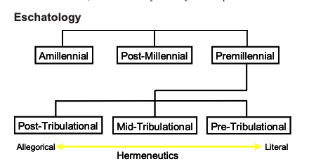



**Video**



## Revelation 20

<small>

Next, I saw an angel coming down from heaven, who had the key to the Abyss and a great chain in his hand. He seized the dragon, that ancient serpent, who is the Devil and Satan [the Adversary], and chained him up for a thousand years. He threw him into the Abyss, locked it, and sealed it over him; so that he could not deceive the nations anymore until the thousand years were over. After that, he has to be set free for a little while. Then I saw thrones, and those seated there received authority to judge. And I saw the souls of those who had been beheaded for testifying about Yeshua and proclaiming the Word of God, also those who had not worshipped the beast or its image and had not received the mark on their foreheads and on their hands. They came to life and ruled with the Messiah for a thousand years. (The rest of the dead did not come to life until the thousand years were over.) This is the first resurrection. Blessed and holy is anyone who has a part in the first resurrection; over him, the second death has no power. On the contrary, they will be cohanim of God and of the Messiah, and they will rule with him for the thousand years.

When the thousand years are over, the Adversary will be set free from his prison and will go out to deceive the nations in the four quarters of the earth, Gog and Magog, to gather them for the battle. Their number is countless as the sand on the seashore, and they came up over the breadth of the Land and surrounded the camp of God's people and the city he loves. But fire came down from heaven and consumed them. The Adversary who had deceived them was hurled into the lake of fire and sulfur, where the beast and the false prophet were, and they will be tormented day and night forever and ever.

Next, I saw a great white throne and the One sitting on it. Earth and heaven fled from his presence, and no place was found for them. And I saw the dead, both great and small, standing in front of the throne. Books were opened, and another book was opened, the Book of Life, and the dead were judged from what was written in the books, according to what they had done. The sea gave up the dead in it, and Death and Sh'ol gave up the dead in them, and they were judged, each according to what he had done. Then Death and Sh'ol were hurled into the lake of fire. This is the second death---the lake of fire. Anyone whose name was not found written in the Book of Life was hurled into the lake of fire.

</small>


Pro tip: you want to ensure your name is found in the Book of Life!


### The Millennium: Eschatology Review

*  Here we encounter the Millennium, the thousand-year reign of Christ. 
*  Scholars over the centuries have debated whether this is literal or figurative. This debate results in the fundamental division in eschatology (the study of end times). 
* Amillennialism
    * Augustine (mid 4th Century) held that the Millennium was symbolic of the present age, not a literal time period.
    * Amillennial is the term we give to this body of thought. 
    * In general, this view says that Jesus isn't literally coming back to earth; He's going to rule in our hearts as the church makes the world a better and better place.
    * Amillennialism sees chapter 20 as summarizing all the events in the preceding chapters versus describing a distinct chronological period.
    * Cynically, we can trace this belief to the fact that he lived during the time of Constantine when the church was married to the world (see our discussion on the letter to Pergamos). 
        * Since the church was the ruling and governing authority, it sure would have been politically incorrect to say that Jesus is coming back to rid the world of its evil rulers!
    * Missler believes the two most significant shortcomings of the Protestant reformation are that first, they did not reassess the Church's position concerning Israel (as discussed in Romans 9-11), and second, they did not reassess the Church's position on Amillennialism. 
    * As a result, Calvin and Luther were staunch Amillennialists, and most protestants and Catholics hold an Amillennial theology.
    * As a result, most denominations have very little use for the Book of Revelation, which is generally viewed as a protracted fable of good vs. evil. 
    * To them, the warnings in Rev 22:18-19 about not adding or removing anything from the book of *prophecy* might be especially chilling.
* A literal millennium
  * In contrast, men who lived before Constantine, during times of persecution, such as Irenaeus and Justin Martyr, viewed Revelation as prophetic of events that will occur in the future. 
  * In other words, there will be a literal reign of Jesus, albeit with some debate over whether the "1000 years" is literal or figurative for "a long time." 
  * We could call these "Millenialists" as opposed to Amillennialists. 
  * There were groups divided into whether Jesus was coming before the Millennium (i.e., premillennialists) or after (i.e., postmillennialists).
    * Postmillennialists are rare these days.
    * This view tends to be a hybrid of premillennialism and amillennialism, with the millennium as the present historical age, which gets better and better until Jesus returns.
    * By contrast, most conservative scholars are premillennial
    * Premillennials are further divided on when they believe the rapture will occur. 
* See the summary chart below from Chuck Missler.

Interestingly, while one's belief in the end-times may seem like a non-essential matter -- after all, we can live our life here, and God will take care of the details after we pass -- there is a connection between one's eschatology and one's hermeneutics (how one interprets the Bible.)

We closed lesson 18 with Luke 1:32-33 and the promise to Mary that Jesus would sit on the throne of his father David forever. This throne did not exist during Mary's day and does not exist today. If one is Amillennial, he or she is asserting the throne will never exist because Jesus doesn't literally reign. If we take the Bible seriously, we realize that the Davidic covenant was promised to David in 2 Sam 7:11-16 and Isaiah 7:13. It was continuously reaffirmed, promised to Mary, and recognized by the First Church Council in Acts 15:15-18. Act 15:15-18

-   <small>And with this, the words of the prophets agree, just as it is written, [16] "'After this I will return, and I will rebuild the tent of David that has fallen; I will rebuild its ruins, and I will restore it, [17] that the remnant of mankind may seek the Lord, and all the Gentiles who are called by my name, says the Lord, who makes these things [18] known from of old.'</small>

**Evidence for Premilliannialism**

-   There are 1845 references to a future Messianic Ruler in the Hebrew Bible and 318 references in the New Testament.
-   For every prophecy of Jesus' 1st Coming, there are eight of His 2nd Coming.
-   In the Lord's Prayer, we pray "Thy Kingdom Come"; are we serious when we pray this?
-   Many Jewish texts describe a period that bridges the present age with the age to come. Most view this as a period of messianic peace.
    -   A few early traditions view the millennium as the last of seven 1000-year periods.
    -   In other words, 6000 years of man's rule followed by 1000 years of Messiah's rule.
    -   In this sense, it is a Sabbath rest: 6000 years shall we toil; 1000 years shall we rest.

*Amillennial theology would deny all of these.*

### Connection with Ezekiel

Chapters 20 and 21 seem to correlate with the final chapters of Ezekiel:

-   Israel's resurrection; David ruling -- Ezekiel 36-37 -- Rev 20:1-6

-   The war with Gog and Magog -- Ezekiel 38-39 -- Rev 20:7-10

-   The New Jerusalem's temple -- Ezekiel 40-48 -- Rev 21-22
    * Some see this temple as being the Millennial Temple

### Warning and encouragement from Peter on the Last Days

It doesn't appear Peter was Amillennial:

<small>2Pe 3:3-13 knowing this first of all, that scoffers will come in the last days with scoffing, following their own sinful desires. [4] They will say, "Where is the promise of his coming? For ever since the fathers fell asleep, all things are continuing as they were from the beginning of creation." [5] For they deliberately overlook this fact, that the heavens existed long ago, and the earth was formed out of water and through water by the word of God, [6] and that by means of these, the world that then existed was deluged with water and perished. [7] But by the same word, the heavens and earth that now exist are stored up for fire, being kept until the day of judgment and destruction of the ungodly. [8] But do not overlook this one fact, beloved, that with the Lord, one day is as a thousand years and a thousand years as one day. [9] The Lord is not slow to fulfill his promise as some count slowness but is patient toward you, not wishing that any should perish but that all should reach repentance. [10] But the day of the Lord will come like a thief, and then the heavens will pass away with a roar, and the heavenly bodies will be burned up and dissolved, and the earth and the works that are done on it will be exposed. [11] Since all these things are thus to be dissolved, what sort of people ought you to be in lives of holiness and godliness, [12] waiting for and hastening the coming of the day of God, because of which the heavens will be set on fire and dissolved, and the heavenly bodies will melt as they burn! [13] But according to his promise, we are waiting for new heavens and a new earth in which righteousness dwells.</small>

## Rev 20:1

| Next, I saw an angel coming down from heaven, who had the key to the Abyss and a great chain in his hand. |
| --- |

-   Rev 9:1-3 And the fifth angel blew his trumpet, and I saw a star fallen from heaven to earth, and he was given the key to the shaft of the bottomless pit. [2] He opened the shaft of the bottomless pit, and from the shaft rose smoke like the smoke of a great furnace, and the sun and the air were darkened with the smoke from the shaft. [3] Then from the smoke came locusts on the earth, and they were given power like the power of scorpions of the earth.

-   Luk 8:30-32 Jesus then asked him, "What is your name?" And he said, "Legion," for many demons had entered him. [31] And they begged him not to command them to depart into the abyss. [32] Now a large herd of pigs was feeding there on the hillside, and they begged him to let them enter these. So he permitted them.

-   Jude 1:6 And the angels who did not stay within their own position of authority, but left their proper dwelling, he has kept in eternal chains under gloomy darkness until the judgment of the great day---

-   In chapter 9, demonic locusts were released. Here Satan is going to be bound.

## Rev 20:2-3

| He seized the dragon, that ancient serpent, who is the Devil and Satan [the Adversary], and chained him up for a thousand years. He threw him into the Abyss, locked it, and sealed it over him; so that he could not deceive the nations anymore until the thousand years were over. After that, he has to be set free for a little while.|
| --- |

-   Isa 24:21-22 On that day, the LORD will punish the host of heaven, in heaven, and the kings of the earth, on the earth. [22] They will be gathered together as prisoners in a pit; they will be shut up in a prison, and after many days they will be punished.

    -   This is the dragon/serpent from Chapter 12.

-   1 Peter 5:8 Be sober-minded; be watchful. Your adversary, the devil prowls around like a roaring lion, seeking someone to devour.

-   The antichrist and false prophet were dealt with in chapter 19; now Messiah deals with Satan himself.

-   Jewish texts speak of fallen angels being bound until the day of their judgment.

-   Chuck Missler, a premillennialist, liked to quip, "if we're presently in the Millennium (as Amillennialists and postmillennialists say we are), then Satan's chain is way too long."

    -   In other words, the different views, which hold that things are getting better and better, are difficult to reconcile with the reality of evil.

-   In verses 8-9, Satan escapes protective custody and has free reign once again.

-   We aren't told much more than that and are not told why this happens.

## Rev 20:4

| Then I saw thrones, and those seated on them received authority to judge. And I saw the souls of those who had been beheaded for testifying about Yeshua and proclaiming the Word of God, also those who had not worshipped the beast or its image and had not received the mark on their foreheads and on their hands. They came to life and ruled with the Messiah for a thousand years.|
| --- |

-   Matthew 19:28 Jesus said to them, "Truly, I say to you, in the new world, when the Son of Man will sit on his glorious throne, you who have followed me will also sit on twelve thrones, judging the twelve tribes of Israel.

-   1 Cor 6:2 Or do you not know that the saints will judge the world? And if the world is to be judged by you, are you incompetent to try trivial cases?

-   Romans 8:17 and if children, then heirs---heirs of God and fellow heirs with Christ, provided we suffer with him in order that we may also be glorified with him.

-   Dan 7:22 until the Ancient of Days came, and judgment was given for the saints of the Most High, and the time came when the saints possessed the kingdom.

-   The fact that John sees only Tribulation-era believers does not necessarily preclude all believers or even those martyred by some other form besides beheading.

    -   During the Roman Empire, beheading was the method of execution for *Roman Citizens.*

    -   Non-citizens suffered a much more painful ending, including death by crucifixion.

-   McGee sees the Raptured believers in heaven, while the tribulation believers, along with the Old Testament saints reigning on earth from Jerusalem, with Jesus "commuting" back and forth. I don't know if I'd go that far.

-   Missler sees four classes: the OT saints, the raptured church, the Tribulation Martyrs, and the Tribulation saints. The final group is those who did not die during the tribulation and did not worship the beast.

-   However it works out, I'm sure we'll be happy with our position as long as we are found written in the book of life!

## Rev 20:5

| (The rest of the dead did not come to life until the thousand years were over.) This is the first resurrection.|
| --- |

-   Stern inserts "the rest of the dead" as a parenthetical phrase to refer to the wicked who are not part of the first resurrection. Keener also interprets the passage this way. Otherwise, we are left with a third group of believers who miss out on the Millennium, contradicting verse 6.

## Rev 20:6

| Blessed and holy is anyone who has a part in the first resurrection; over him, the second death has no power. On the contrary, they will be cohanim of God and of the Messiah, and they will rule with him for the thousand years.|
| --- |

-   In putting it all together, everyone involved with the first resurrection reigns with Him for 1000 years; therefore, the "rest of the dead" who are not raised until after the 1000 years (in verse 5) can't be part of the first resurrection.

-   Rev 1:6 and made us a kingdom, priests to His God and Father, to him be glory and dominion forever and ever. Amen.

-   Back in chapter one, we examined the seven beatitudes in Revelation. This one is number six. The last one is in Rev 22:7.

## Rev 20:7-8

| When the thousand years are over, the Adversary will be set free from his prison and will go out to deceive the nations in the four quarters of the earth, Gog and Magog, to gather them for the battle. Their number is countless as the sand on the seashore;|
| --- |

-   Eze 7:2 "And you, O son of man, thus says the Lord GOD to the land of Israel: An end! The end has come upon the four corners of the land.

-   Eze 38:2-3 "Son of man, set your face toward Gog, of the land of Magog, the chief prince of Meshech and Tubal, and prophesy against him [3] and say, Thus says the Lord GOD: Behold, I am against you, O Gog, chief prince of Meshech and Tubal.

-   We aren't told why Satan is released. From our perspective, his list of charges should be adequate to secure a conviction.

    -   Perhaps like in Job 1, Satan argues, "of course, people follow you in the Millennium because you don't give them a choice not to."

    -   To phrase the above slightly differently, those who are alive (not resurrected) during the Millennium do not have the opportunity to accrue merit when Satan is bound.

-   While it appears that all flesh would be wiped out in the tribulation, some commentators contend there will be folks living at that time who will make it into the Millennium. These are the people who end up being deceived in the end.

-   Jewish sages write of mass conversions of Pagans in the messianic time to be followed by mass apostasy in the time of Gog and Magog.

-   Gog is the final enemy of Israel in Ezekiel 38-39. Much of the battle appears to align with the gathering of the nations against God in Revelation 16 and 19 more than it does in Revelation 20.

    -   Many see Gog and Magog as symbolic of all nations who assemble for war against the Lord.

    -   The gematria value is 70, which is the number of the nations

    -   Psa 2:1 Why do the nations rage and the peoples plot in vain?

## Rev 20:9

| and they came up over the breadth of the Land and surrounded the camp of God's people and the city he loves. But fire came down from heaven and consumed them.|
| --- |

-   Psa 87:2 the LORD loves the gates of Zion more than all the dwelling places of Jacob.

-   Eze 39:6 I will send fire on Magog and on those who dwell securely in the coastlands, and they shall know that I am the LORD.

-   Isa 30:33 For a burning place has long been prepared; indeed, for the king, it is made ready, its pyre made deep and wide, with fire and wood in abundance; the breath of the LORD, like a stream of sulfur, kindles it.

## Rev 20:10

| The Adversary who had deceived them was hurled into the lake of fire and sulfur, where the beast and the false prophet were, and they will be tormented day and night forever and ever.|
| --- |

-   Satan is ultimately judged and defeated.

## Rev 20:11 The Great White Throne Judgment

| Next, I saw a great white throne and the One sitting on it. Earth and heaven fled from his presence, and no place was found for them.|
| --- |

-   This is judgment day just before the New Heaven and New Earth.

-   Romans 14:10 Why do you pass judgment on your brother? Or you, why do you despise your brother? For we will all stand before the judgment seat of God;

-   2 Cor 5:10 For we must all appear before the judgment seat of Christ, so that each one may receive what is due for what he has done in the body, whether good or evil.

-   Romans 2:16 on that day when, according to my gospel, God judges the secrets of men by Christ Jesus.

## Rev 20:12

| And I saw the dead, both great and small, standing in front of the throne. Books were opened, and another book was opened, the Book of Life, and the dead were judged from what was written in the books, according to what they had done.|
| --- |

-   Mal 3:18 Then once more you shall see the distinction between the righteous and the wicked, between one who serves God and one who does not serve him.

-   Books were opened implies this will be a very public ceremony; the wicked will have nowhere to hide.

-   Exo 32:31-33 So Moses returned to the LORD and said, "Alas, these people have sinned a great sin. They have made for themselves gods of gold. [32] But now, if you will forgive their sin---but if not, please blot me out of your book that you have written." [33] But the LORD said to Moses, "Whoever has sinned against me, I will blot out of my book.

-   Dan 12:2 And many of those who sleep in the dust of the earth shall awake, some to everlasting life, and some to shame and everlasting contempt.

-   Joh 5:27-29 And he has given him authority to execute judgment because he is the Son of Man. [28] Do not marvel at this, for an hour is coming when all who are in the tombs will hear his voice [29] and come out, those who have done good to the resurrection of life, and those who have done evil to the resurrection of judgment.

-   Eze 18:20-23 The soul who sins shall die. The son shall not suffer for the iniquity of the father, nor the father suffer for the iniquity of the son. The righteousness of the righteous shall be upon himself, and the wickedness of the wicked shall be upon himself. [21] "But if a wicked person turns away from all his sins that he has committed and keeps all my statutes and does what is just and right, he shall surely live; he shall not die. [22] None of the transgressions that he has committed shall be remembered against him; for the righteousness that he has done, he shall live. [23] Have I any pleasure in the death of the wicked, declares the Lord GOD, and not rather that he should turn from his way and live?

-   Psa 69:27-29 Add to them punishment upon punishment; may they have no acquittal from you. [28] Let them be blotted out of the book of the living; let them not be enrolled among the righteous. [29] But I am afflicted and in pain; let your salvation, O God, set me on high!

-   Jewish thought holds that all will be judged according to their works (Psa 62:12; Pro 24:12; Jer 17:10; Jer 32:19; Eze 18:30), but former sinful works are canceled by true repentance would not count against the righteous (Eze 18:21-22).

## Rev 20:13

| The sea gave up the dead in it; and Death and Sh'ol gave up the dead in them, and they were judged, each according to what he had done.|
| --- |

-   Mt 25:46 And these will go away into eternal punishment, but the righteous into eternal life.

    -   This is the sheep and goat judgment in Matthew 25:31-46.

-   Hos 13:14 I shall ransom them from the power of Sheol; I shall redeem them from Death. O Death, where are your plagues? O Sheol, where is your sting? Compassion is hidden from my eyes.

-   The "rest of the dead did not come to life until the thousand years were ended" clause in verse 5 appears to go here.

## Rev 20:14-15

| Then Death and Sh'ol were hurled into the lake of fire. This is the second death---the lake of fire. Anyone whose name was not found written in the Book of Life was hurled into the lake of fire.|
| --- |

-   Isa 25:8 He will swallow up death forever, and the Lord GOD will wipe away tears from all faces, and the reproach of his people he will take away from all the earth, for the LORD has spoken.

-   Rev 21:8 But as for the cowardly, the faithless, the detestable, as for murderers, the sexually immoral, sorcerers, idolaters, and all liars, their portion will be in the lake that burns with fire and sulfur, which is the second death."

-   Rev 2:11 He who has an ear, let him hear what the Spirit says to the churches. The one who conquers will not be hurt by the second death.'

    -   Born once, die twice; born twice, die once.

-   Death and Sheol have served their purposes; now, they are no longer needed. Sin is now banished.

-   In Rev 21:1, we'll see that the sea also disappears. The sea in the Bible is a symbol of death, destruction, fear, and tribulation.

-   Some maintain that the Lake of Fire symbolizes a world without and eternally separated from God. Either way, it's not a good place.

-   The text makes it clear that it is not God who has determined their fate but the people themselves by their deeds.

    -   Those deeds specifically include a failure to trust in the salvation of Yeshua, the messiah.

    -   A contradiction from our perspective

        -   The righteous can only become so by a miracle of God. We were dead in our sins. A dead person cannot resurrect or save himself.

        -   The unrighteous has only himself to blame.

    -   Mark 9:43-48 And if your hand causes you to sin, cut it off. It is better for you to enter life crippled than with two hands to go to hell, to the unquenchable fire. 45 And if your foot causes you to sin, cut it off. It is better for you to enter life lame than with two feet to be thrown into hell. 47 And if your eye causes you to sin, tear it out. It is better for you to enter the kingdom of God with one eye than with two eyes to be thrown into hell, 48 'where their worm does not die, and the fire is not quenched.'

-   Two deaths:

    -   Physical death: separation of the body from the soul

    -   Spiritual death: separation of the soul from God

-   Next time, we'll get a peek into eternity with the new heaven and new earth.

 

