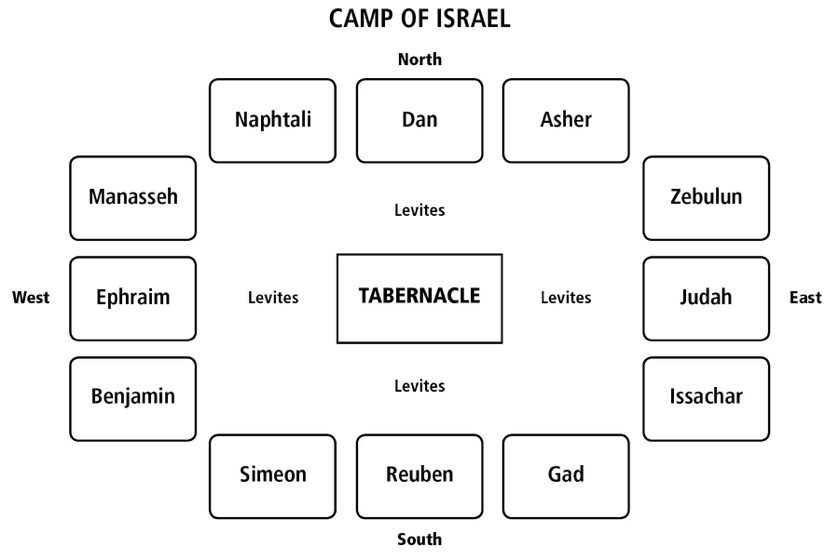



**Videos**

**Part I**


**Part II**


## Revelation 21 -- the Age to Come

<small>**Then I saw a new heaven and a new earth, for the old heaven and the old earth had passed away, and the sea was no longer there. Also, I saw the holy city, New Yerushalayim, coming down out of heaven from God, prepared like a bride beautifully dressed for her husband. I heard a loud voice from the throne say, "See! God's Sh'khinah is with mankind, and he will live with them. They will be his people, and he himself, God-with-them, will be their God. He will wipe away every tear from their eyes. There will no longer be any death, and there will no longer be any mourning, crying, or pain; because the old order has passed away." Then the One sitting on the throne said, "Look! I am making everything new!" Also, he said, "Write, 'These words are true and trustworthy!' " And he said to me, "It is done! I am the 'A' and the 'Z,' the Beginning and the End. To anyone thirsty, I will give water free of charge from the Fountain of Life. He who wins the victory will receive these things, and I will be his God, and he will be my son. But as for the cowardly, the untrustworthy, the vile, the murderers, the sexually immoral, those involved with the occult and with drugs, idol-worshippers, and all liars---their destiny is the lake burning with fire and sulfur, the second death." One of the seven angels having the seven bowls full of the seven last plagues approached me and said, "Come! I will show you the Bride, the Wife of the Lamb." He carried me off in the Spirit to the top of a great, high mountain and showed me the holy city, Yerushalayim, coming down out of heaven from God. It had the Sh'khinah of God so that its brilliance was like that of a priceless jewel, like a crystal-clear diamond. It had a great, high wall with twelve gates; at the gates were twelve angels and inscribed on the gates were the names of the twelve tribes of Isra'el. There were three gates to the east, three gates to the north, three gates to the south, and three gates to the west. The wall of the city was built on twelve foundation stones, and on these were the twelve names of the twelve emissaries of the Lamb. The angel speaking with me had a gold measuring rod with which to measure the city, its gates, and its wall. The city is laid out in a square, its length equal to its width. With his rod, he measured the city at 1,500 miles, with length, width, and height the same. He measured its wall at 216 feet by human standards of measurement, which the angel was using. The wall was made of diamond, and the city was of pure gold resembling pure glass. The foundations of the city wall were decorated with all kinds of precious stones---the first foundation stone was diamond, the second sapphire, the third chalcedony, the fourth emerald, the fifth sardonyx, the sixth carnelian, the seventh chrysolite, the eighth beryl, the ninth topaz, the tenth chrysoprase, the eleventh turquoise, and the twelfth amethyst. The twelve gates were twelve pearls, with each gate made of a single pearl. The city's main street was pure gold, transparent as glass. I saw no Temple in the city, for Adonai, God of heaven's armies, is its Temple, as is the Lamb. The city has no need for the sun or the moon to shine on it because God's Sh'khinah gives it light, and its lamp is the Lamb. The nations will walk by its light, and the kings of the earth will bring their splendor into it. Its gates will never close; they stay open all day because night will not exist there, and the honor and splendor of the nations will be brought into it. Nothing impure may enter it, nor anyone who does shameful things or lies; the only ones who may enter are those whose names are written in the Lamb's Book of Life.**</small>

## Introduction

* In the Old Testament and the Gospels, the messianic age (millennium, Kingdom of/from Heaven) and the age to come (new heaven/earth, eternity) are often blurred. 
    *  The Jewish Sages have consistently interpreted Isaiah 64:4 as referring to the age to come. 
    *  **Isa 64:4** "From of old no one has heard or perceived by the ear, no eye has seen a God besides you, who acts for those who wait for him" (Isa 64:4). 
    * What is the age to come like?  We can't tell you! No eye has seen it! It's indescribable!
* That distinction is more noticeable in the apostolic writings, where it becomes clear that they are two distinct eras. 
    * 1 Cor 2:9-10 But, as it is written, "What no eye has seen, nor ear heard, nor the heart of man imagined, what God has prepared for those who love him"--- [10] these things God has revealed to us through the Spirit. For the Spirit searches everything, even the depths of God.
    * Paul is saying what formerly was hidden is now partially revealed through the spirit.
*The distinction is most noticeable in Revelation. 
    * In Chapters 19 and 20 we learned about the thousand-year reign of King Messiah. Then there was a great resurrection and judgment of the wicked. 
    * Here in Chapter 21, we are looking at the world to come.
* The world to come (olam habah in Hebrew) is not quite the same as our concept of heaven if our concept of heaven is that we are bodiless souls floating around in bliss. 
    * Revelation teaches us that by this time in the world to come, we have physical bodies. 
    * At the same time, the world to come will not share the same physical characteristics of our planet today. 
    * It is some type of physical spirituality that is beyond our capacity to comprehend. 
    * It might be helpful to think of it as not an entirely new earth but as a recycled, repurposed, or even restored earth,  redesigned the way God originally intended it.

## Rev 21:1 John sees a New Heaven and a New Earth

<small>**Then I saw a new heaven and a new earth, for the first heaven and the first earth had passed away, and the sea was no more.**</small>

-   Isa 65:17-19 "For behold, I create new heavens and a new earth, and the former things shall not be remembered or come into mind. [18] But be glad and rejoice forever in that which I create; for behold, I create Jerusalem to be a joy, and her people to be a gladness. [19] I will rejoice in Jerusalem and be glad in my people; no more shall be heard in it the sound of weeping and the cry of distress.

-   With death gone, conditions are set for the restoration of Eden as God intended. If it were up to us, we would mess it up again. This time, we have a Messiah to shepherd us.

-   Isaiah also reminds us that a restored Eden could not be possible without the judgment of chapter 20 and the preceding chapters.

    -   Isa 66:22-24 "For as the new heavens and the new earth that I make shall remain before me, says the LORD, so shall your offspring and your name remain. [23] From new moon to new moon, and from Sabbath to Sabbath, all flesh shall come to worship before me, declares the LORD. [24] "And they shall go out and look on the dead bodies of the men who have rebelled against me. For their worm shall not die, their fire shall not be quenched, and they shall be an abhorrence to all flesh."

-   This is the "creation being set free."

    -   Rom 8:19-21 For the creation waits with eager longing for the revealing of the sons of God. [20] For the creation was subjected to futility, not willingly, but because of him who subjected it, in hope [21] that the creation itself will be set free from its bondage to corruption and obtain the freedom of the glory of the children of God.

-   No more sea.

    -   Lancaster sees the sea as symbolic of chaos, and the chaos is now gone.

    -   Stern sees the "sea" as referring to Israel's western border of the Mediterranean Sea no longer there. The entire earth is now Messiah's Kingdom. In his view, there will still be oceans.

    -   Lancaster also noted that in the ancient Canaanite religion, the god Mot lived in the desert/wilderness and is the Hebrew word for death. The god Yam lived in the sea and is the Hebrew word for sea. Here we are told Yam is no more and in verse four we will be told Mot is no more. This type of symbolism is throughout the prophets and the Psalms, so possibly John picked up on it.

    -   Missler notes that the sea provides antiseptic salinity that purges, cleanses, and preserves our planet. There is no need for such cleansing action any longer.

## Rev 21:2 The New Jerusalem

<small>**And I saw the holy city, new Jerusalem, coming down out of heaven from God, prepared as a bride adorned for her husband.**</small>

-   The capital city of the age to come is heavenly Jerusalem.

    -   **Hebrews 11:16** But as it is, they desire a better country, that is, a heavenly one. Therefore God is not ashamed to be called their God, for he has prepared for them a city.

-   Hebrew has a dual form in addition to singular and plural.

    -   Yerushalayim - יְרוּשָׁלַיִם - is in the dual form, 
    -  This is a subtle hint that there are and were always two Jerusalems, one earthly and one heavenly or sometimes called the one above.

    -   **Gal 4:26** But the Jerusalem *above* is free, and she is our mother.

-   We have talked about how the church, the bride of Christ, is to remain pure and undefiled for her marriage to the Son.

-   In the same way, the city of Jerusalem is depicted as a bride, pure and beautifully dressed for her Husband.

    -   **Isa 62:5-7** For as a young man marries a young woman, so shall your sons marry you, and as the bridegroom rejoices over the bride, so shall your God rejoice over you. [6] On your walls, O Jerusalem, I have set watchmen; all the day and all the night they shall never be silent. You who put the LORD in remembrance, take no rest, [7] and give him no rest until he establishes Jerusalem and makes it a praise in the earth.

-   Mystically, Jerusalem and God's people are the same, as we shall see when we get to verse 9.

-   Jerusalem is contrasted with Babylon, the great whore.

## Rev 21:3 the Word tabernacled among us

<small>**And I heard a loud voice from the throne saying, "Behold, the dwelling place of God is with man. He will dwell with them, and they will be his people, and God himself will be with them as their God.**</small>

-   This is the final fulfillment of God's promise to Abraham and Moses.

    -   **Gen 17:7** And I will establish my covenant between me and you and your offspring after you throughout their generations for an everlasting covenant, to be God to you and to your offspring after you.

    -   **Ex 6:7** I will take you to be my people, and I will be your God, and you shall know that I am the LORD your God, who has brought you out from under the burdens of the Egyptians.

-   The Hebrew word Shekinah means "dwelling" or "tabernacle."  Another name for the wilderness tabernacle was "the Tent of Meeting."

    -   **Lev 26:11-12** I will make my dwelling among you, and my soul shall not abhor you. [12] And I will walk among you and will be your God, and you shall be my people.

    -   **Zec 2:10** Sing and rejoice, O daughter of Zion, for behold, I come, and I will dwell in your midst, declares the LORD

    -   **2 Chronicles 6:18** "But will God indeed dwell with man on the earth? Behold, heaven and the highest heaven cannot contain you, how much less this house that I have built!" (the answer is "Yes!")

    -   **John 1:14** And the Word became flesh and dwelt among us, and we have seen his glory, glory as of the only Son from the Father, full of grace and truth.

-   One of the Messiah's names is "Immanuel," God with us. Isaiah 7:14 has a double-fulfillment: once at Jesus' first coming and once here.

    -   **Isa 7:14** Therefore the Lord himself will give you a sign. Behold, the virgin shall conceive and bear a son, and shall call his name Immanuel.

## Rev 21:4 Former things passed away

<small>**He will wipe away every tear from their eyes, and death shall be no more, neither shall there be mourning, nor crying, nor pain anymore, for the former things have passed away."**</small>

-   Tears, death, mourning, crying, and pain are the "former things" Isaiah spoke about. 

    -   **Isa 25:8** He will swallow up death forever, and the Lord GOD will wipe away tears from all faces, and the reproach of his people he will take away from all the earth, for the LORD has spoken

    -   **Isa 65:17** "For behold, I create new heavens and a new earth, and the **former things** shall not be remembered or come into mind."
- The age to come is a correction of man's mortal condition caused by sin.

## Rev 21:5-6 All things new

<small>**And he who was seated on the throne said, "Behold, I am making all things new." Also he said, "Write this down, for these words are trustworthy and true." And he said to me, "It is done! I am the Alpha and the Omega, the beginning and the end. To the thirsty I will give from the spring of the water of life without payment.**</small>

-   IT IS DONE!

    -   As with the seventh angel who said "it is done" (Rev 16:17), this is not the same Greek word for "it is finished" that Jesus used on the cross, but it is the same word He used in Matthew 5:18.

        -   Mat 5:17-18 "Do not think that I have come to abolish the Law or the Prophets; I have not come to abolish them but to fulfill them. [18] For truly, I say to you, until heaven and earth pass away, not an iota, not a dot, will pass from the Law until all is **accomplished**.

    -   Without sin, there is no need for a behavior code. Heaven and earth have passed away and the Torah is fulfilled, completed, and accomplished

        -   To say that the Torah is "finished" probably isn't the best English translation; we will be LIVING OUT TORAH every day

        -   **Jer 31:33** For this is the covenant that I will make with the house of Israel after those days, declares the LORD: I will put my Torah within them, and I will write it on their hearts. And I will be their God, and they shall be my people.
        -   God has accomplished Torah within us

-   Living water without payment

    -   This is a reference to Isaiah

        -   **Isa 55:1-2** "Come, everyone who thirsts, come to the waters; and he who has no money, come, buy and eat! Come, buy wine and milk without money and without price. [2] Why do you spend your money for that which is not bread, and your labor for that which does not satisfy? Listen diligently to me, and eat what is good, and delight yourselves in rich food.

    -   Thirst represents spiritual need; living water is spiritual satisfaction in the form of the Holy Spirit. There is only one source of living water, and that's Jesus.

        -   **Rev 7:17** For the Lamb in the midst of the throne will be their shepherd, and he will guide them to springs of living water, and God will wipe away every tear from their eyes.

        -   **Joh 7:37-39** On the last day of the feast, the great day, Jesus stood up and cried out, "If anyone thirsts, let him come to me and drink. [38] Whoever believes in me, as the Scripture has said, 'Out of his heart will flow rivers of living water.'" [39] Now, this he said about the Spirit, whom those who believed in him were to receive, for as yet the Spirit had not been given because Jesus was not yet glorified.

    -   Revelation (and indeed the entire Bible) is very clear that there are only two choices for each of us.

        -   Drink the cup of blessing or the cup of wrath

        -   Dine at the Lamb's marriage supper or be a feast for the birds of the air

        -   Choose life or choose death (Deu 30:19 I call heaven and earth to witness against you today, that I have set before you life and death, blessing and curse. Therefore choose life, that you and your offspring may live)

        -   **Pro 14:27** The fear of the LORD is a fountain of life that one may turn away from the snares of death.

*  Straddling the fence is not an option we have, though many live their lives only partially committed.

## Rev 21:7 Promise to the overcomer

<small>**The one who conquers will have this heritage, and I will be his God and he will be my son.**</small>

-   This heritage: the Jewish sages talk about being "granted a portion in the world to come." 
    * We attain this portion by overcoming.

    -   **1 Jn 5:4** For everyone who has been born of God overcomes the world. And this is the victory that has overcome the world---our faith.

-   Rev 12:11 tells us how to be an overcomer

    -   **Rev 12:11** And they have conquered him by the blood of the Lamb and by the word of their testimony, for they loved not their lives even unto death.

    -   I would read this as we don't necessarily have to be martyred but we have to be prepared to be.
    -  In a certain sense, we should live our lives not caring that we may be martyred one day.

    -   Remember the word for "martyr" is the same as "witness."

## Rev 21:8 Promise to the non-overcomers

<small>**But as for the cowardly, the faithless, the detestable, as for murderers, the sexually immoral, sorcerers, idolaters, and all liars, their portion will be in the lake that burns with fire and sulfur, which is the second death."**</small>

-   This group has not overcome, but hasbeen overtaken by this world
-   This class of people has no portion in the world to come.

-   In addition to staunch unbelievers, these could also be the non-overcomers who were in the church. As soon as tough times hit, they abandoned the faith. They chose the other path rather than suffer for and with Jesus.

-   Some translations say "fearful" whereas the ESV says "cowardly. Fear is not from God (except for Fear of the LORD). Do you worry a lot? I do and that's not good. (I'm not saying that worrying will send you into the lake of fire; but it's not God's will for us to worry).

-   In the last lesson we looked at a passage from Ezekiel which says if one repents of former sin, that person is welcomed as righteous.

    -   Rev 9:21, nor did they **repent** of their murders or their sorceries or their sexual immorality or their thefts.

    -   The key is repenting and not remaining in these sins.

## Rev 21:9-11 Jerusalem is the Bride of Christ

<small>**Then came one of the seven angels who had the seven bowls full of the seven last plagues and spoke to me, saying, "Come, I will show you the Bride, the wife of the Lamb." And he carried me away in the Spirit to a great, high mountain, and showed me the holy city Jerusalem coming down out of heaven from God, having the glory of God, its radiance like a most rare jewel, like a jasper, clear as crystal.**</small>

-   We typically think of the Bride as the Church; but here it is Jerusalem.
    - Is there a deeper meaning?
        - Jerusalem was established by God to be a city set apart; it even has shalom (peace) as part of it's name,  yet today it is anything but set apart and anything but peaceful.
        - The church was established by God to be a people set apart and holy to Him.  We are to be vessels for the Light of the World while not being ensnared in the world's systems of idolatry and adultery.  How well are we doing on those things?

-   The imagery of being shown a great city is from Ezekiel

    -   **Eze 40:2** In visions of God he brought me to the land of Israel, and set me down on a very high mountain, on which was a structure like a city to the south.

## Rev 21:12-13 Twelve gates/tribes

<small>**It had a great, high wall, with twelve gates, and at the gates twelve angels, and on the gates the names of the twelve tribes of the sons of Israel were inscribed---on the east three gates, on the north three gates, on the south three gates, and on the west three gates.**</small>

-   This recalls the camp in the wilderness as well as Ezekiel's vision

    -   **Num 2:2** "The people of Israel shall camp each by his own standard, with the banners of their fathers' houses. They shall camp facing the tent of meeting on every side.

    -   **Eze 48:30-34** On the north side, three gates, the gate of Reuben, the gate of Judah, and the gate of Levi, the gates of the city being named after the tribes of Israel. On the east side, which is to be 4,500 cubits, three gates (etc. for the remaining tribes.)

-   There is a conjecture by an early church father that relates to the camp of Israel. We'll discuss this more at the end of the lesson.

## Rev 21:14 Twelve foundations/apostles

<small>**14 And the wall of the city had twelve foundations, and on them were the twelve names of the twelve apostles of the Lamb.**</small>

-   Access to the city is through Israel. Paul stated this a number of times, yet most of the gentile church sees itself divorced from Israel.

    -   The 12 tribes are the walls, the 12 apostles are the foundation and Jesus is the chief cornerstone.

    -   **Eph 2:19-20** So then you are no longer strangers and aliens, but you are fellow citizens with the saints and members of the household of God, [20] built on the foundation of the apostles and prophets, Christ Jesus himself being the cornerstone,

    -   "Strangers and aliens" are terms for gentiles who attached themselves to the Israelites but had to remain outside the camp. We are no longer outside Israel but "grafted in." See Romans 9-11.

-   Take note of the word "foundation." We're going to come back to this at the end of the lesson.

## Rev 21:15 Taking measurements

<small>**15 And the one who spoke with me had a measuring rod of gold to measure the city and its gates and walls.**</small>

-   In chapter 11, John was told to measure the tribulation temple

    -   **Rev 11:1-2** Then I was given a measuring rod like a staff, and I was told, "Rise and measure the temple of God and the altar and those who worship there, [2] but do not measure the court outside the temple; leave that out, for it is given over to the nations, and they will trample the holy city for forty-two months.

-   This is like Ezekiel's vision

    -   **Eze 40:3** When he brought me there, behold, there was a man whose appearance was like bronze, with a linen cord and a measuring reed in his hand. And he was standing in the gateway.

-   Here John is measuring the city, not the temple; in fact, there is no Temple building because God dwells in the city.

## Rev 21:16-17 12,000 stadia 144 cubits

<small>**16 The city lies foursquare, its length the same as its width. And he measured the city with his rod, 12,000 stadia. Its length and width and height are equal. He also measured its wall, 144 cubits by human measurement, which is also an angel's measurement.**</small>

-   We don't really know what a stadia is in "age to come" terms but in earthly terms, this is about 1500 miles on a side.

    -   In the same way, we don't know what an "angel's cubit" is. 144 human cubits is approximately 216 feet.
    -   Note that there is a "height" measurement in addition to a wall height measurement - don't assume this heavenly city is limited to three earthly dimensions.

-   The many "12"s in this section are probably more significant than the actual measurements

    -   Using only the length and width, the surface area is 12,000 * 12,000 or 144,000,000 square stadia.  The volume would be 12,000 cubed.

## Rev 21:18-20 Wall of precious stones

<small>**18 The wall was built of jasper, while the city was pure gold, like clear glass. The foundations of the wall of the city were adorned with every kind of jewel. The first was jasper, the second sapphire, the third agate, the fourth emerald, the fifth onyx, the sixth carnelian, the seventh chrysolite, the eighth beryl, the ninth topaz, the tenth chrysoprase, the eleventh jacinth, the twelfth amethyst.**</small>

-   This fulfills the prophecy by Isaiah.

    -   **Isa 54:12** I will make your pinnacles of agate, your gates of carbuncles, and **all your wall of precious stones.**

-   The High Priest's chest plate (called an Ephod) had 12 stones representing the 12 tribes of Israel.

    -   The High Priest was to bear the tribes on his heart before the LORD continuously.

    -   **Exo 28:17-20** You shall set in it four rows of stones. A row of sardius, topaz, and carbuncle shall be the first row; [18] and the second row an emerald, a sapphire, and a diamond; [19] and the third row a jacinth, an agate, and an amethyst; [20] and the fourth row a beryl, an onyx, and a jasper. They shall be set in gold filigree.

-   We will see at the beginning of Chapter 22 that the New Jerusalem is a restored Eden, and our relationship with God is restored to how He originally designed it.

    -   Ezekiel uses similar precious stone imagery to describe Lucifer's "clothing" in Eden.

    -   Eze 28:13 You were in Eden, the garden of God; every precious stone was your covering, sardius, topaz, and diamond, beryl, onyx, and jasper, sapphire, emerald, and carbuncle; and crafted in gold were your settings and your engravings. On the day that you were created they were prepared.

## Rev 21:21-22 Pearly gates and streets of gold

<small>**21 And the twelve gates were twelve pearls, each of the gates made of a single pearl, and the street of the city was pure gold, like transparent glass. And I saw no temple in the city, for its temple is the Lord God the Almighty and the Lamb.**</small>

-   Here are the famous pearly gates, but I don't see Peter anywhere.
-  Pearls are an interesting item in the Bible
    - An oyster is an unclean sea creature because it has neither fins nor scales.
    - While observant Jews will shun shellfish, people don't typically eat pearls.  Therefore Jews don't generally have any issues with them and treat them as a precious gem along with their geological counterparts.  I've heard it taught by Christians that pearls themselves are unclean - this simply isn't true.  As a side note, along these lines, the blue dye required for the Tzitzit in Numbers 15:38 comes from a snail (unclean to eat but no problem in handling the dye). 
    - Pearls generally represent wisdom and knowledge in the Bible, but are often used in what we might call a "backhanded" way.
    - Examples:
        - Proverbs 8:11 and Job 28:18 Wisdom is better than pearls
        - Proverbs 20:16 There are gold and pearls; but the dearest jewels are lips that speak knowledge
        - Mt 7:6 Do not give to dogs what is holy, and do not throw your pearls before swine
        - Revelation 17:4, the whore of Babylon was adorned in pearls (and 1 Ti 2:9 Paul says respectable women should not be adorned with pearls!)
        - Rev 18:12, and 18:16 the merchants of Babylon mourned the loss of pearls

-   The temple would be redundant in the age to come because God is present.

## Rev 21:23-25 "I am the light of the World"

<small>**And the city has no need of sun or moon to shine on it, for the glory of God gives it light, and its lamp is the Lamb. By its light will the nations walk, and the kings of the earth will bring their glory into it, and its gates will never be shut by day---and there will be no night there.**</small>

-   Self-explanatory as to why there is no need of the sun or the moon!

    -   This is a fulfillment of Isaiah 60.

    -   **Isa 60:19-20** The sun shall be no more your light by day, nor for brightness shall the moon give you light; but the LORD will be your everlasting light, and your God will be your glory. [20] Your sun shall no more go down, nor your moon withdraw itself; for the LORD will be your everlasting light, and your days of mourning shall be ended.

-   In Genesis, light was created first. The sun and moon were not created until the fourth day.

    -   **Gen 1:3-4** And God said, "Let there be light," and there was light. And God saw that the light was good. And God separated the light from the darkness.

    -   **"Let there be light"** were also the first words spoken by God.

## Rev 21:26 The nations will be there

<small>**They will bring into it the glory and the honor of the nations.**</small>

-   From the very beginning, nations who glorify God are rewarded; those who do not are cursed

    -   **Gen 12:1-3** Now the LORD said to Abram, "Go from your country and your kindred and your father's house to the land that I will show you. [2] And I will make of you a great nation, and I will bless you and make your name great, so that you will be a blessing. [3] I will bless those who bless you, and him who dishonors you I will curse, and in you all the families of the earth shall be blessed."

    -   Nations, often portrayed negatively in Scripture, are now purified.

    -   There will be no unregenerate goyim in the New Earth.

    -   It also appears that gentiles will not lose their national identity (at least not entirely).

## Rev 21:27 Nothing unclean will be present

<small>**But nothing unclean will ever enter it, nor anyone who does what is detestable or false, but only those who are written in the Lamb's book of life.**</small>

-   This is not saying that there are unclean people present who can't enter

-   This is saying that there will not be any unclean present.

-   The judgment has passed

-   The gates never close; there is no one on the New Earth who is not welcome.

## Rev 22:1-3 -- Restored Eden

<small>**Then the angel showed me the river of the water of life, bright as crystal, flowing from the throne of God and of the Lamb [2] through the middle of the street of the city; also, on either side of the river, the tree of life with its twelve kinds of fruit, yielding its fruit each month. The leaves of the tree were for the healing of the nations. [3] No longer will there be anything accursed, but the throne of God and of the Lamb will be in it, and his servants will worship him.**</small>

-   This is describing what appears to be a restored Garden of Eden, in the middle of which is the throne of God and of the Lamb.

-   We'll unpack this more next lesson, but we needed to reference the passage prior to discussing the ancient conjecture below.

-   Note the river flows out from the Throne and through the middle of the city. It doesn't encompass the entire New Jerusalem but is only a portion of it.

## 

## Irenaeus Conjecture -- three levels of the New Jerusalem

The following is adapted from an article, "What No Eye Has Seen: Heaven, Paradise, and the City in Irenaeus' Against Heresies 5:36" by D. Thomas Lancaster.

In his extensive work, *Against Heresies,* the early church father Irenaeus (130-202) claimed to be passing on teaching about the New Jerusalem from "the Elders, the disciples of the apostles," in other words the Elders were men in direct contact with the apostles. 2000 years after the fact, we have no way of proving or disproving these assertions, but we have no reason to believe Irenaeus was not being genuine.

Based on the comparison to the camp of Israel in Numbers 2-5, as well as referencing some of Jesus' teachings, Irenaeus taught that believers will be assigned to one of three levels in the New Jerusalem.

If you look at the image below, you'll see there are three separate areas. 1) The Tabernacle (Camp of God), 2) The Levites (Camp of the Levites), 3) The 12 Tribes (Camp of Israel).

Irenaeus then noted three distinct areas of the New Jerusalem: 1) the Throne/Temple (not a building but the Lord God Almighty and the Lamb- Rev 21:22), 2) the restored Garden of Eden (Rev 22:1-3), and the city extending to the four walls, with the gates of three tribes within each wall (Rev 21:12-21).

Irenaeus then connected passages in Matthew 13:23, Luke 14, and 1 Corinthians 3:10-15

-   **Mt 13:23** As for what was sown on good soil, this is the one who hears the word and understands it. He indeed bears fruit and yields, in one case a hundredfold, in another sixty, and in another thirty.

-   **Luke 14:7-11** Now he told a parable to those who were invited, when he noticed how they chose the places of honor, saying to them, [8] "When you are invited by someone to a wedding feast, do not sit down in a place of honor, lest someone more distinguished than you be invited by him, [9] and he who invited you both will come and say to you, 'Give your place to this person,' and then you will begin with shame to take the lowest place. [10] But when you are invited, go and sit in the lowest place, so that when your host comes he may say to you, 'Friend, move up higher.' Then you will be honored in the presence of all who sit at table with you. [11] For everyone who exalts himself will be humbled, and he who humbles himself will be exalted."

-   **1 Co 3:10-15** According to the grace of God given to me, like a skilled master builder I laid a foundation, and someone else is building upon it. Let each one take care how he builds upon it. [11] For no one can lay a foundation other than that which is laid, which is Jesus Christ. [12] Now if anyone builds on the foundation with gold, silver, precious stones, wood, hay, straw--- [13] each one's work will become manifest, for the Day will disclose it, because it will be revealed by fire, and the fire will test what sort of work each one has done. [14] If the work that anyone has built on the foundation survives, he will receive a reward. [15] If anyone's work is burned up, he will suffer loss, though he himself will be saved, but only through fire.

While Jesus did not explain the significance of the 100/60/30, the teaching of the Apostles was apparently that there will be three different levels of reward

-   If all a believer had was wood, hay, and stubble, maybe representing only a 30-fold or less increase of the gifts God gave to him, that person would get the third, outermost level correlating to the Camp of Israel.

    -   He is within the city walls.

    -   In other words, he is still in a dwelling place in the Presence of Jesus.

    -   He is still saved but only through fire.

-   A second believer might be in the 60-fold increase category. This person would be in the second circle, the restored Eden.

    -   Perhaps this person had a little bit of gold and silver left over after his wood, hay, and stubble burned.

    -   He fared better than most, but perhaps he wasted too much time watching TV or surfing the internet when he could have focused his efforts on using God's gifts.

-   Then there's the person who was All-in for Jesus during his time on earth. This person, according to this teaching, receives the highest level in the temple/throne district.

    -   This person is still a sinner and made some mistakes, but overall he or she used their gifts to the fullest.

    -   Maybe instead of watching sports, they helped with the food pantry or the church nursery every week and never complained;

    -   Maybe instead of taking family vacations to Disneyworld, they took their family on mission trips to help others.

    -   Perhaps they quietly gave 20% of their income away anonymously.

    -   They did these things without expecting any reward.

    -   Further, they would tell you that they enjoyed serving others and never once considered what they did a sacrifice or a trade-off.

    -   These people received a 100-fold return and will be rewarded with a dwelling place in the town closest to the Throne.

In summary, Irenaeus quoted the Elders as saying, "Then those who are deemed worthy of an abode in the (center) will go there, others shall enjoy the delights of Paradise/Eden, and others shall possess the splendor of the City; for everywhere the Savior shall be seen to the degree that they who see Him shall be worthy."

I'm not at all saying this is precisely how our heavenly rewards will be doled out, but given that it's a second-century tradition, it is worth considering.

I do know that Scripture is clear that the way we spend our lives today somehow, someway affects our standing in the next life.

-   Jesus had several parables where the King went away and left his servants in charge. He then returned one day unexpectedly and demanded an accounting of how the servants grew the business while the king was away.

    -   Those who were profitable were rewarded;

    -   Those who squandered or did nothing with the master's gifts were punished.

-   God has given us gifts; one day, He will demand to know what we did with those gifts.

-   Did we put them to work, or did we waste them?

Jesus' instruction to take the lowest seat at the wedding banquet, also reminds us to never assume a place of honor and prestige. In the teaching, the individual took his seat at the lower station and waited to be invited to a higher station.

We must never assume we have arrived and must never do work to get a reward. Paul expressed it this way in Philippians:

-   **Php 3:12-15** Not that I have already obtained this or am already perfect, but I press on to make it my own because Christ Jesus has made me his own. [13] Brothers, I do not consider that I have made it my own. But one thing I do: forgetting what lies behind and straining forward to what lies ahead, [14] I press on toward the goal for the prize of the upward call of God in Christ Jesus. [15] Let those of us who are mature think this way, and if in anything you think otherwise, God will reveal that also to you.

If you have a few more miles on your tires like me, you may look back on your Christian life and regret of all the missed opportunities and wasted time spent on non-kingdom tasks. I would remind us of Roman 8:1 that there is no condemnation for those in Christ. Our story is not yet over. With every breath left in us, we can decide to live for God and not ourselves.

If you're a younger believer, I encourage you to use the coming days, months, and years for His glory, not yours. The world and the Enemy will do all they can to get you comfortable. Perhaps let this message serve as a wake-up alarm that the righteous deeds that we do for God have eternal value. Jesus told us to store up our treasure in heaven. We do this to serve Him and honor Him with our time and resources while we are on earth.

May each of us live our lives here and now in such a way that on Judgment Day, Jesus says to us, "well done good and faithful servant; you have been faithful over a little; I will set you over much. Enter into the joy of your master" (Mt 25:21). Then in that day may we be surprised to hear Jesus say to us, "Friend, move up higher" (Luke 14:10).

 

