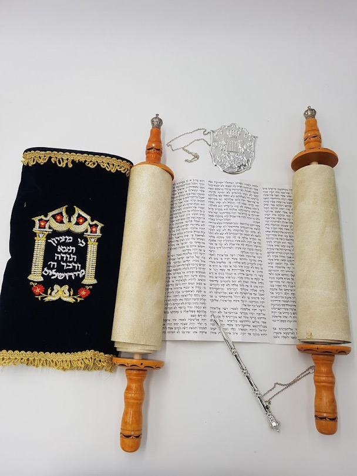

**Video**



## Revelation 22

<small>**Next the angel showed me the river of the water of life, sparkling like crystal, flowing from the throne of God and of the Lamb. Between the main street and the river was the Tree of Life producing twelve kinds of fruit, a different kind every month; and the leaves of the tree were for healing the nations— no longer will there be any curses. The throne of God and of the Lamb will be in the city, and his servants will worship him; they will see his face, and his name will be on their foreheads. Night will no longer exist, so they will need neither the light of a lamp nor the light of the sun, because Adonai, God, will shine upon them. And they will reign as kings forever and ever. Then he said to me, "These words are true and trustworthy: Adonai, God of the spirits of the prophets, sent his angel to show his servants the things that must happen soon." "Look! I am coming very soon. Blessed is the person who obeys the words of the prophecy written in this book!" Then I, Yochanan, the one hearing and seeing these things, when I heard and saw them, I fell down to worship at the feet of the angel showing them to me. But he said to me, "Don't do that! I am only a fellow-servant with you and your brothers, the prophets and the people who obey the words in this book. Worship God!" Then he said to me, "Don't seal up the words of the prophecy in this book, because the time of their fulfillment is near. "Whoever keeps acting wickedly, let him go on acting wickedly; whoever is filthy, let him go on being made filthy. "Also, whoever is righteous, let him go on doing what is righteous; and whoever is holy, let him go on being made holy." "Pay attention!" [says Yeshua,] "I am coming soon, and my rewards are with me to give to each person according to what he has done. I am the 'A' and the 'Z,' the First and the Last, the Beginning and the End." How blessed are those who wash their robes, so that they have the right to eat from the Tree of Life and go through the gates into the city! Outside are the homosexuals, those involved with the occult and with drugs, the sexually immoral, murderers, idol-worshippers, and everyone who loves and practices falsehood. "I, Yeshua, have sent my angel to give you this testimony for the Messianic communities. I am the Root and Offspring of David, the bright Morning Star. The Spirit and the Bride say, 'Come!' Let anyone who hears say, 'Come!' And let anyone who is thirsty come—let anyone who wishes, take the water of life free of charge." I warn everyone hearing the words of the prophecy in this book that if anyone adds to them, God will add to him the plagues written in this book. And if anyone takes anything away from the words in the book of this prophecy, God will take away his share in the Tree of Life and the holy city, as described in this book. "The one who is testifying to these things says, 'Yes, I am coming soon!' " Amen! Come, Lord Yeshua! May the grace of the Lord Yeshua be with all!**</small>

## Rev 22:1

<small>**Then the angel showed me the river of the water of life, bright as crystal, flowing from the throne of God and of the Lamb through the middle of the street of the city;**</small>

-   Our tour of the New Jerusalem continues from chapter 22.

-   This river actually started flowing at the other end of the Bible

    -   Gen 2:10 A river flowed out of Eden to water the garden, and there it divided and became four rivers.

-   This is a river flowing out of Jerusalem as seen by Ezekiel in the Messianic Temple. Notice the trees on one side and on the other.

    -   Eze 47:1-8 Then he brought me back to the door of the temple, and behold, water was issuing from below the threshold of the temple toward the east (for the temple faced east). The water was flowing down from below the south end of the threshold of the temple, south of the altar. [2] Then he brought me out by way of the north gate and led me around on the outside to the outer gate that faces toward the east; and behold, the water was trickling out on the south side. [3] Going on eastward with a measuring line in his hand, the man measured a thousand cubits, and then led me through the water, and it was ankle-deep. [4] Again he measured a thousand, and led me through the water, and it was knee-deep. Again he measured a thousand, and led me through the water, and it was waist-deep. [5] Again he measured a thousand, and it was a river that I could not pass through, for the water had risen. It was deep enough to swim in, a river that could not be passed through. [6] And he said to me, "Son of man, have you seen this?" Then he led me back to the bank of the river. [7] As I went back, I saw on the bank of the river very many trees on the one side and on the other. [8] And he said to me, "This water flows toward the eastern region and goes down into the Arabah, and enters the (Dead) sea; when the water flows into the sea, the water will become fresh.

    -   Joe 3:18 "And in that day the mountains shall drip sweet wine, and the hills shall flow with milk, and all the streambeds of Judah shall flow with water; and a fountain shall come forth from the house of the LORD and water the Valley of Shittim.

    -   Zec 14:8 On that day living waters shall flow out from Jerusalem, half of them to the eastern sea and half of them to the western sea. It shall continue in summer as in winter.

        -   In Israel, the rivers don't flow in the summer

    -   Psa 46:4 There is a river whose streams make glad the city of God, the holy habitation of the Most High.

    -   Psa 36:8 They feast on the abundance of your house, and you give them drink from the river of your delights.

        -   The word for "your delights" is עֲדָנֶ֣יךָ (edanecha) "your Eden"

-   Jesus makes a direct reference to this river flowing out of the Throne in the age to come.

    -   Joh 7:38 Whoever believes in me, as the Scripture has said, 'Out of his heart will flow rivers of living water.'"

    -   There are no other Hebrew scripture verses that say anything a river of living water besides the ones above.

## Rev 22:2

<small>**Also, on either side of the river, the tree of life with its twelve kinds of fruit, yielding its fruit each month. The leaves of the tree were for the healing of the nations.**</small>

-   This is a clear reference back to the same Ezekiel 47 passage.

    -   Eze 47:12 And on the banks, on both sides of the river, there will grow all kinds of trees for food. Their leaves will not wither, nor their fruit fail, but they will bear fresh fruit every month, because the water for them flows from the sanctuary. Their fruit will be for food, and their leaves for healing."

-   Revelation is alluding to Ezekiel 47. As it turns out, Ezekiel is alluding to Psalm 1, which has the exact same symbolism of a tree by a stream, plentiful fruit, and a strong leaf.

    -   Psa 1:1-3 Blessed is the man who walks not in the counsel of the wicked, nor stands in the way of sinners, nor sits in the seat of scoffers; [2] but his delight is in the law of the LORD, and on his law he meditates day and night. [3] He is like a tree planted by streams of water that yields its fruit in its season, and its leaf does not wither. In all that he does, he prospers.

        -   This river flowing out from the throne in the New Jerusalem represents the righteous among us who delight in the Torah of the Lord.

        -   Last lesson we quoted Jeremiah 31:33 and the New Covenant. The hallmark of a new covenant believer is that "I will put my Torah within them, and I will write it on their hearts. And I will be their God and they shall be my people."
        
        - So we see there is a connection between the Etz Chaim that gives eternal life and the Word of God.  Therefore it should come as no surprise when Peter says to jesus “You have the words of eternal life.” in John 6:68.

        -  interestingly, the word etz can also mean wood (since wood comes from a tree).  The wooden handle on each end of a Torah scroll is called an Etz Chaim, signifying the connection of the Torah with the Tree of Life.  Even if the handle is silver, it is still called an Etz Chaim.  The word of God is the etz Chaim that gives eternal life.

> Do you still think the Torah has no meaning or relevance for us as Christians? I hope not!  

-   Humanity is stored back to the original relationship between God and Man in Genesis

    -   Gen 2:9 And out of the ground the LORD God made to spring up every tree that is pleasant to the sight and good for food. The tree of life was in the midst of the garden, and the tree of the knowledge of good and evil.

    -   In fact, our position will be better.

    -   The Tree of Life represents the resurrection. It symbolizes the attainment of immortality.

        -   Adam and Eve were not permitted to partake of the Tree of Life, because they were not (yet) resurrected. (Gen 3:22-24. This is the reason they were banished from the Garden of Eden and God had to put a cherubim with a flaming sword to guard the way, let they eat and become immortal in their fallen state.)

        -   We will be permitted! In fact, Jesus promises it to the Church in Ephesus.

        -   Rev 2:7 He who has an ear, let him hear what the Spirit says to the churches. To the one who conquers I will grant to eat of the tree of life, which is in the paradise of God.'

-   We are now all clear to eat from the tree of life and will get a different fruit each month.

    -   Apparently, we won't entirely be outside of time boundaries

    -   There will still be a mechanism for marking time and seasons.

-   Healing here might be in the sense of "making whole."

## Rev 22:3-4

<small>**No longer will there be anything accursed, but the throne of God and of the Lamb will be in it, and his servants will worship him. They will see his face, and his name will be on their foreheads.**</small>

-   The curse from Genesis 3 is lifted

-   This is a fulfillment of Zec 14:11

    -   And it shall be inhabited, for there shall never again be a decree of utter destruction. Jerusalem shall dwell in security.

-   Instead of a Temple, God and the Lamb will have a throne directly.

-   When we worship we're going to be fully dialed in and completely satisfied (hopefully without people on a stage jumping around like cheerleaders, light shows, or smoke machines).

-   See His face

    -   In our world, God is concealed.

        -   Exo 33:20 But," he said, "you cannot see my face, for man shall not see me and live."
        -  1Co 13:12-13 For now we see in a mirror dimly, but then face to face. Now I know in part; then I shall know fully, even as I have been fully known. [13] So now faith, hope, and love abide, these three; but the greatest of these is love.

    -   In the messianic Era, everyone will know the Lord that He is real, but He won't be fully visible.

    -   In the World to Come everyone will stand in His presence. We will know Him face to face in unhindered and unimpeded fellowship.

-   Foreheads -- we've worked with this earlier.

    -   The beast branded his name and number on his followers.

    -   God marks His followers.

    -   Again, this likely refers to God's word being at the forefront in our hearts and minds

    -   Deu 6:8 You shall bind them as a sign on your hand, and they shall be as frontlets between your eyes.

## Rev 22:5

<small>**And night will be no more. They will need no light of lamp or sun, for the Lord God will be their light, and they will reign forever and ever.**</small>

-   We discussed this in the last lesson.

-   The original light, before the sun, moon, and the stars, will illuminate once again.

-   Isa 60:19 The sun shall be no more your light by day, nor for brightness shall the moon give you light; but the LORD will be your everlasting light, and your God will be your glory.

-   Literal and spiritual darkness is lifted. Messiah is the source of our literal and spiritual illumination.

## Rev 22:6 -- The conclusion

<small>**And he said to me, "These words are trustworthy and true. And the Lord, the God of the spirits of the prophets, has sent his angel to show his servants what must soon take place."**</small>

-   John appears to be back on Patmos at this point, still in the presence of his angelic tour guide.

-   Note the parallels between this last section and Chapter 1 over the next couple of verses.

-   Rev 1:1-2 The revelation of Jesus Christ, which God gave him to show to his servants the things that must soon take place. He made it known by sending his angel to his servant John, [2] who bore witness to the word of God and to the testimony of Jesus Christ, even to all that he saw.

-  This is a literary style called inclusio. Repeating or restating something said at the beginning of the book.
-  Matthew does this as well with the meaning of the word Immanuel at 1:23 and 28:20.
  -  Mat 1:23 “Behold, the virgin shall conceive and bear a son, and they shall call his name Immanuel” (which means, **God with us**).
  -  Mat 28:20 teaching them to observe all that I have commanded you. And behold, **I am with you** always, to the end of the age.”

## Rev 22:7

<small>**"And behold, I am coming soon. Blessed is the one who keeps the words of the prophecy of this book."**</small>

-   Rev 1:3 Blessed is the one who reads aloud the words of this prophecy, and blessed are those who hear, and who keep what is written in it, for the time is near.

-   "Soon" appears four times in this passage. The repetition adds to the sense of urgency and builds anticipation.

## Rev 22:8-9

<small>**I, John, am the one who heard and saw these things. And when I heard and saw them, I fell down to worship at the feet of the angel who showed them to me, but he said to me, "You must not do that! I am a fellow servant with you and your brothers the prophets, and with those who keep the words of this book. Worship God."**</small>

-   Rev 1:17 When I saw him, I fell at his feet as though dead. But he laid his right hand on me, saying, "Fear not, I am the first and the last,

-   See discussion at Rev 19:10.

- The fact that John repeats worshipping angels suggests to some scholars that he may have been trying to indirectly address a problem of angel worship that had crept into the Asia Minor congregations.

## Rev 22:10-11

<small>**And he said to me, "Do not seal up the words of the prophecy of this book, for the time is near. Let the evildoer still do evil, and the filthy still be filthy, and the righteous still do right, and the holy still be holy."**</small>

-   Daniel was instructed to seal up his words, possibly until Jesus "unlocked" them in Matthew 24:15 and John unlocked them in Revelation.

    -   Mat 24:15 "So when you see the abomination of desolation spoken of by the prophet Daniel, standing in the holy place (let the reader understand)

-   Revelation is meant to be read and understood by his own generation and all subsequent generations of believers.

-   Let the evildoer still do evil.

    -   One thought is that God knows who the wicked are and who the righteous are.

    -   The truly wicked are past the point of being able to repent from God's perspective

    -   From our perspective, we don't know that a "wicked" person we may encounter doesn't need to receive an invitation from us to repent to move over to the "righteous" category.

    -   After studying the judgments and what will happen to non-believers, our hearts should be heavy for those who are perishing.

    -   There may be a veiled invitation here --as if to say, after reading all of this, if you still wish to be wicked and filthy, you bear full responsibility for what happens next. If not, then be righteous and do right.

    -   Verse 17 is a direct invitation for all who read these words and acknowledge that they are spiritually thirsty.

-   This seems to recall the sheep and goat judgment of Matthew 25, which we will look at below.

## Rev 22:12

<small>**"Behold, I am coming soon, bringing my recompense with me, to repay each one for what he has done.**</small>

-   Isa 40:10-11 Behold, the Lord GOD comes with might, and his arm rules for him; behold, his reward is with him, and his recompense before him. [11] He will tend his flock like a shepherd; he will gather the lambs in his arms; he will carry them in his bosom, and gently lead those that are with young.

-   Isa 62:11-12 Behold, the LORD has proclaimed to the end of the earth: Say to the daughter of Zion, "Behold, your salvation comes; behold, his reward is with him, and his recompense before him." [12] And they shall be called The Holy People, The Redeemed of the LORD; and you shall be called Sought Out, A City Not Forsaken.

-   Mat 25:29 For to everyone who has will more be given, and he will have an abundance. But from the one who has not, even what he has will be taken away.

## Rev 22:13

<small>**I am the Alpha and the Omega, the first and the last, the beginning and the end."**</small>

-   Rev 1:17-18 When I saw him, I fell at his feet as though dead. But he laid his right hand on me, saying, "Fear not, I am the first and the last, [18] and the living one. I died, and behold I am alive forevermore, and I have the keys of Death and Hades.

-   Isa 44:6 Thus says the LORD, the King of Israel and his Redeemer, the LORD of hosts: "I am the first and I am the last; besides me there is no god.

-   While there are distinctions in the roles and responsibilities between the Father and the Son, Jesus unquestionably identifies Himself as *Adonai*, the I AM, the Aleph and the Tav.

## Rev 22:14

<small>**Blessed are those who wash their robes, so that they may have the right to the tree of life and that they may enter the city by the gates.**</small>

-   There is some scholarly debate as to whether verses 14 and 15 are from Jesus or John.

-   Those who wash their robes will attain the resurrection of the dead and attain life in the age to come.

-   Again, we see a special blessing poured out on martyrs

    -   Rev 7:14 I said to him, "Sir, you know." And he said to me, "These are the ones coming out of the great tribulation. They have washed their robes and made them white in the blood of the Lamb.

    -   This is not to say that life in the age to come is only for martyrs.

    -   Jesus makes us all white as snow.

    -   The book is written to those facing persecution as an encouragement to stand fast.

    -   We don't have to be martyred to live a life as a sold-out disciple of Yeshua.

-   As we saw back in the seven letters, to eat from the Tree of Life means to enjoy eternal fellowship with Yeshua.

## Rev 22:15

<small>**Outside are the dogs and sorcerers and the sexually immoral and murderers and idolaters, and everyone who loves and practices falsehood.**</small>

-   I love dogs, but in the Bible dogs are often a pejorative term for gentiles.

    -   Clearly not the God-fearing, believing gentiles representing the righteous among the nations.

    -   Bill Mounce (author of the Greek textbooks used in conservative seminaries) says "dog" has the connotation of "religious corruptor."

-   Pharmakos = sorcery. As Dr. Stern translates, "those who misuse drugs in connection with the occult."

-   They are on the outside of the world to come; meaning they aren't there.

    -   They are not outside the gates trying to get in.

    -   The wicked have already been dealt with and have no share of the world to come.

-   Apparently not many from Washington DC will be in the age to come.

## Rev 22:16

<small>**"I, Jesus, have sent my angel to testify to you about these things for the churches. I am the root and the descendant of David, the bright morning star."**</small>

-   This is a bit unusual.

    -   An angel is speaking on behalf of Jesus.

    -   John received the entire testimony from an Angel not directly from Jesus (we saw that in Rev 1:1).

    -   Here, the angel is quoting Jesus and talking about himself in the 3rd person.

-   Root of David - Isa 11:1 There shall come forth a shoot from the stump of Jesse, and a branch from his roots shall bear fruit.

-   Descendant of David - Jer 23:5 "Behold, the days are coming, declares the LORD, when I will raise up for David a righteous Branch, and he shall reign as king and deal wisely, and shall execute justice and righteousness in the land.

## Rev 22:17

<small>**The Spirit and the Bride say, "Come." And let the one who hears say, "Come." And let the one who is thirsty come; let the one who desires take the water of life without price.**</small>

-   Isa 55:1 "Come, everyone who thirsts, come to the waters; and he who has no money, come, buy and eat! Come, buy wine and milk without money and without price."

-   See discussion at Revelation 21:2-6.

## Rev 22:18-19

<small>**I warn everyone who hears the words of the prophecy of this book: if anyone adds to them, God will add to him the plagues described in this book, and if anyone takes away from the words of the book of this prophecy, God will take away his share in the tree of life and in the holy city, which are described in this book.**</small>

-   It's curious given this warning that Revelation has the most textual variants of any book of the Bible. You think they would have been more cautious when copying!

-   Unlike any other New Testament book, Revelation is given the same weight as the Torah

    -   Deu 4:2 You shall not add to the word that I command you, nor take from it, that you may keep the commandments of the LORD your God that I command you.

-   Of course, I believe the warning is aptly applied to the entire Bible and one which we must keep in mind at all times.

    -   Modern Christian interpretation is prone to reading in things that the text does not say, and simultaneously ignoring things the text plainly says much more often than we may realize.

    -   Our goal is to pick at these little by little with the goal to bring people closer to God and his Son Yeshua.

    -   We start every study with Acts 17:11 not to be cute, but to stress the authority of the Word of God over the words of any human teacher, myself included.

-   Our goal has been neither to add nor detract but to extract.

-   In the beginning of the study we said there were over 800 cross-reference verses. I haven't counted but my suspicion is that we ended up with well over that amount.

-   I've got a partial list at Talmidimway.org.

-   Despite all the death and destruction, Revelation is a book of hope.

-   Jesus is coming back quickly.

    -   Quickly is the word where we get tachometer.

    -   When it happens, it will happen fast.

    -   Maranata is a good Aramaic word to know. It means "come lord" or "our Lord has come".

    -   It is one of the most ancient Christian prayers.

-   Whenever you're down or doubting or feeling squeezed by the world, I hope you'll remember this study, and you might want to pray Maranata to remind yourself that you belong to Him, not the world. He is faithful and His words and promises are true.

## Matthew 25

-   Mat 25:31-46 "When the Son of Man comes in his glory, and all the angels with him, then he will sit on his glorious throne. [32] Before him will be gathered all the nations, and he will separate people one from another as a shepherd separates the sheep from the goats. [33] And he will place the sheep on his right, but the goats on the left. [34] Then the King will say to those on his right, 'Come, you who are blessed by my Father, inherit the kingdom prepared for you from the foundation of the world. [35] For I was hungry and you gave me food, I was thirsty and you gave me drink, I was a stranger and you welcomed me, [36] I was naked and you clothed me, I was sick and you visited me, I was in prison and you came to me.' [37] Then the righteous will answer him, saying, 'Lord, when did we see you hungry and feed you, or thirsty and give you drink? [38] And when did we see you a stranger and welcome you, or naked and clothe you? [39] And when did we see you sick or in prison and visit you?' [40] And the King will answer them, 'Truly, I say to you, as you did it to one of the least of these my brothers, you did it to me.' [41] "Then he will say to those on his left, 'Depart from me, you cursed, into the eternal fire prepared for the devil and his angels. [42] For I was hungry and you gave me no food, I was thirsty and you gave me no drink, [43] I was a stranger and you did not welcome me, naked and you did not clothe me, sick and in prison and you did not visit me.' [44] Then they also will answer, saying, 'Lord, when did we see you hungry or thirsty or a stranger or naked or sick or in prison, and did not minister to you?' [45] Then he will answer them, saying, 'Truly, I say to you, as you did not do it to one of the least of these, you did not do it to me.' [46] And these will go away into eternal punishment, but the righteous into eternal life."

-   If we claim to be His disciples, we need to follow His commands. Let us all continue to grow in deliberate discipleship so we are prepared for the day when we meet Him face to face!

## Rev 22:20-21

<small>**He who testifies to these things says, "Surely I am coming soon." Amen. Come, Lord Jesus! The grace of the Lord Jesus be with all. Amen.**</small>

-   Amen!

 

