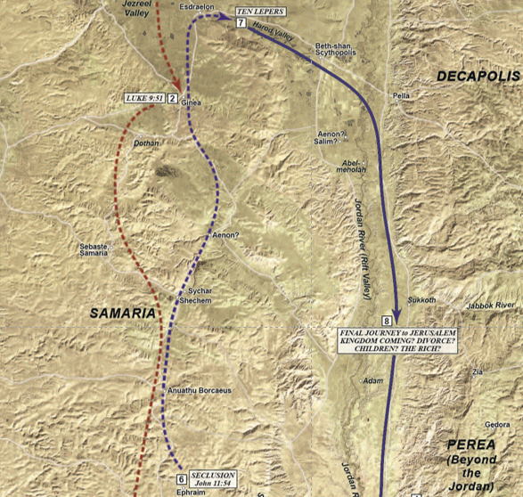
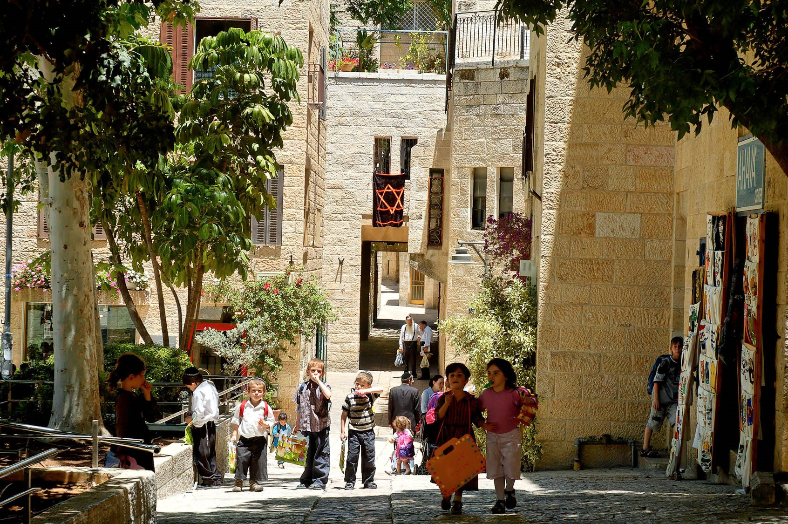

*Gospel Backgrounds* Lesson 37 is titled "Beyond the Jordan."  After leaving the Harod Valley [#7 on the map], Jesus makes His way to the Jordan, just south of where it exits the Sea of Galilee.  The north-south path along the river in this vicinity was along the eastern shore, which the Gospel writers call "Judea beyond the Jordan." [8]

Jesus will engage a group of inquisitive (but not necessarily trecharous) Pharisees who want to know the Master's position on divorce.  As it is today, divorce was a critical and controversial topic because of its impact on family and society.  The Pharisees themselves were divided on when divorce was permissible.  The majority view held that a man could divorce his wife for _any_ reason, including not liking her cooking or even finding another woman more attractive.  The minority view held that the Torah had in view sexual misconduct as the only permissible reason.  Jesus sided with the minority.  The disciples are so taken-aback by Jesus' response that they exclaim "in that case, it is better not to marry!"  

Jesus also teaches about the role of children and we will understand what it means to "become like a child" in order to enter heaven.

Jesus then receives a question from a "rich, young ruler" about what must be done to inherit eternal life. Jesus responds "Keep the Commandments." When the man says that he's done this, Jesus then tells him to sell everything. His response again befuddles the disciples.

The section concludes with Jesus receiving a request from James and John to sit at Jesus' right and left hands during the millenial kingdom, which is often portrayed as a great banquet.  Instead of rebuking their pride, Jesus explains what it means to sit by his side and "drink His cup".



