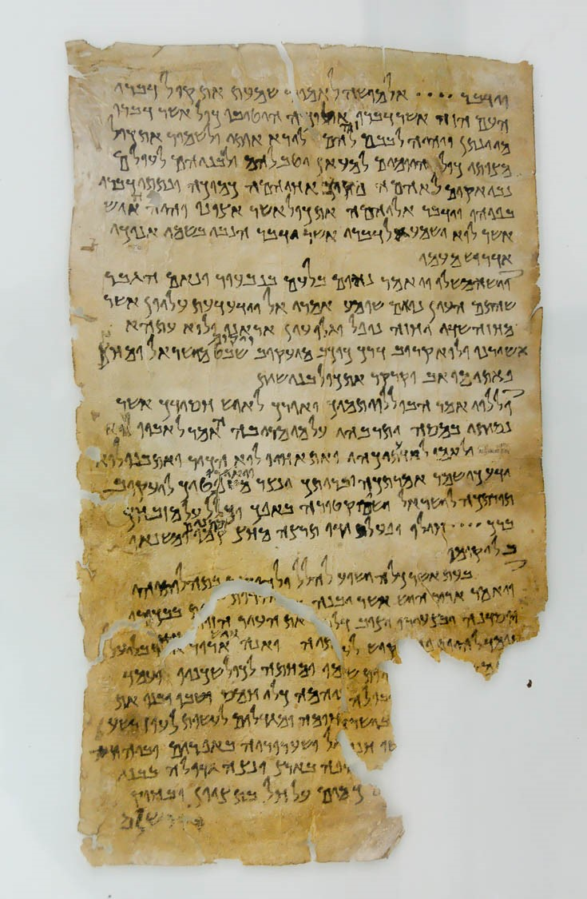

This lesson is titled, "Greetings" because John includes an introduction and salutation very much in the style of correspondence of that day.  
* John will give us the sequence of the delivery:
  * From God to Yeshua/Jesus, from Yeshua to an angel, from an angel to John, and from John to Yeshua's servants.
    * Jesus had to learn of this from the Father.
    * It is important to note that _it is the ANGEL who is speaking to John_.
    * What makes this challenging is that the angel speaks of members of the Godhead in the 1st person.
      * In the Old Testament, we often see "the Angel of the LORD" also speaking of God the Father in the 1st person.
      * I have often assumed that the Angel of the LORD was a pre-incarnate appearance of Jesus.  We call this a "theophany."  
      * Now after studying the context of chapter 1, it may not be that simple.
  * The immediate recipients were His servants at the seven churches in Asia.
    * As we work through the book, begin to notice when things are out of place and how God sets things in their proper order.
    * These Jewish congregations are outside of the land of Israel
      * The promise made by God to their ancestors was to inherit the Land.
      * By the end of Revelation, God will set this right and they will be back inside the Land.
  * Then the document would have spread to all believers at the end of the first century.
  * Then, indirectly, Revelation is written for all believers since, including you and me.
  

* John frequently uses the terms "testimony," and "witness."  The picture to the right is a Dead Sea Scroll fragment (4Q175) called _Testimonia_ (“Messianic Anthology”), 1st century BC.
  * He employs courtroom terminology in all his writings. 
  * In the Gospel of John, he is providing evidence that Jesus is the promised Messiah for all Israel in addition to evidence that the corrupt Jerusalem Temple establishment is usurping their power.
  * In Revelation, he testifies that not only is Jesus the coming king, this time it's not just the corrupt Temple establishment but the corrupt world system that is on trial.
  
* Revelation is unique because it is the only book in the Bible that promises a blessing for those who read, hear and obey.

* In chapter 1 we see the first of several patterns of seven.
  * The commentary section of _talmidimway.org_ will list many of these.
    * For example "Messiah" (v.1) and "Amen" (v.7) each occur exactly seven times throughout the book.
    * There are seven "blessings", beginning with v.3.
    * The description of Jesus in vs. 5-6 has seven attributes.

* In the lesson, we will also unpack what John may have meant by, "I was in the Spirit on the Day of the Lord."

## Read/Listen to the portions

Be sure to read the cross-references.

 

| **Revelation 1:1-11**                                                                                                                                                                                                                                                     | **OT Allusions**                                                                                                                                                                                                                                                                                                                                                                                                                                                                                                                                                                                                                                                                                                                                                                                                                                                                                                                                                                                                                                                          |
|----------------------------------------------------------------------------------------------------------------------------------------------------------------------------------------------------------------------------------------------------------------------|---------------------------------------------------------------------------------------------------------------------------------------------------------------------------------------------------------------------------------------------------------------------------------------------------------------------------------------------------------------------------------------------------------------------------------------------------------------------------------------------------------------------------------------------------------------------------------------------------------------------------------------------------------------------------------------------------------------------------------------------------------------------------------------------------------------------------------------------------------------------------------------------------------------------------------------------------------------------------------------------------------------------------------------------------------------------------|
| Rev 1:1. This is the revelation which God gave to Yeshua the Messiah, so that he could show his servants what must happen very soon. He communicated it by sending his angel to his servant Yochanan,                                                                      | Daniel 2:28 but there is a God in heaven who reveals mysteries, and he has made known to King Nebuchadnezzar what will be in the latter days. Your dream and the visions of your head as you lay in bed are these: 29 To you, O king, as you lay in bed came thoughts of what would be after this, and he who reveals mysteries made known to you what is to be.                                                                                                                                                                                                                                                                                                                                                                                                                                                                                                                                                                                                                                                                                                      |
| Rev 1:2. who bore witness to the Word of God and to the testimony of Yeshua the Messiah, as much as he saw                                                                                                                                                                 |                                                                                                                                                                                                                                                                                                                                                                                                                                                                                                                                                                                                                                                                                                                                                                                                                                                                                                                                                                                                                                                                           |
| Rev 1:3. Blessed are the reader and hearers of the words of this prophecy, provided they obey the things written in it! For the time is near!                                                                                                                              |                                                                                                                                                                                                                                                                                                                                                                                                                                                                                                                                                                                                                                                                                                                                                                                                                                                                                                                                                                                                                                                                           |
| Rev 1:4. From: Yochanan To: The seven Messianic communities in the province of Asia: Grace and shalom to you from the One who is, who was and who is coming; from the sevenfold Spirit before his throne;                                                                  | Isa 11:2 And the Spirit of the LORD shall rest upon him, the Spirit of wisdom and understanding, the Spirit of counsel and might, the Spirit of knowledge and the fear of the LORD.                                                                                                                                                                                                                                                                                                                                                                                                                                                                                                                                                                                                                                                                                                                                                                                                                                                                                  |
| Rev 1:5. and from Yeshua the Messiah, the faithful witness, the firstborn from the dead and the ruler of the earth's kings. To him, the one who loves us, who has freed us from our sins at the cost of his blood,                                                         | Gen 49:11 Binding his foal to the vine and his donkey’s colt to the choice vine, he has washed his garments in wine and his vesture in the blood of grapes.  Psa 89:27 And I will make him the firstborn, the highest of the kings of the earth.                                                                                                                                                                                                                                                                                                                                                                                                                                                                                                                                                                                                                                                                                                                                                                                                                          |
| Rev 1:6. who has caused us to be a kingdom, that is, Cohanim for God, his Father—to him be the glory and the rulership forever and ever. Amen.                                                                                                                             | Ex 19:5-6 Now therefore, if you will indeed obey my voice and keep my covenant, you shall be my treasured possession among all peoples, for all the earth is mine; 6 and you shall be to me a kingdom of priests and a holy nation.’ These are the words that you shall speak to the people of Israel.”  Isa 61:6 but you shall be called the priests of the LORD; they shall speak of you as the ministers of our God; you shall eat the wealth of the nations, and in their glory you shall boast.                                                                                                                                                                                                                                                                                                                                                                                                                                                                                                                                                                       |
| Rev 1:7. Look! He is coming with the clouds! Every eye will see him, including those who pierced him; and all the tribes of the Land will mourn him. Yes! Amen!                                                                                                            | Dan 7:13-14 “I saw in the night visions, and behold, with the clouds of heaven there came one like a son of man, and he came to the Ancient of Days and was presented before him. 14 And to him was given dominion and glory and a kingdom, that all peoples, nations, and languages should serve him; his dominion is an everlasting dominion, which shall not pass away, and his kingdom one that shall not be destroyed.   Isa 52:8 The voice of your watchmen—they lift up their voice; together they sing for joy; for eye to eye they see the return of the LORD to Zion.   Zech 12:10-12 “And I will pour out on the house of David and the inhabitants of Jerusalem a spirit of grace and pleas for mercy, so that, when they look on me, on him whom they have pierced, they shall mourn for him, as one mourns for an only child, and weep bitterly over him, as one weeps over a firstborn. 11 On that day the mourning in Jerusalem will be as great as the mourning for Hadad-rimmon in the plain of Megiddo. 12 The land shall mourn, each family by itself:  |
| Rev 1:8. "I am the 'A' and the 'Z,' " says Adonai, God of heaven's armies, the One who is, who was and who is coming.                                                                                                                                                      | Isa 41:4 Who has performed and done this, calling the generations from the beginning? I, the LORD, the first, and with the last; I am he.                                                                                                                                                                                                                                                                                                                                                                                                                                                                                                                                                                                                                                                                                                                                                                                                                                                                                                                                 |
| Rev 1:9. I, Yochanan, am a brother of yours and a fellow-sharer in the suffering, kingship and perseverance that come from being united with Yeshua. I had been exiled to the island called Patmos for having proclaimed the message of God and borne witness to Yeshua.   |  Dan 10:2-4 In those days I, Daniel, was mourning for three weeks. 3 I ate no delicacies, no meat or wine entered my mouth, nor did I anoint myself at all, for the full three weeks. 4 On the twenty-fourth day of the first month, as I was standing on the bank of the great river (that is, the Tigris)                                                                                                                                                                                                                                                                                                                                                                                                                                                                                                                                                                                                                                                                                                                                                                                                                                                                                                                                                                                                                                                                         |
| Rev 1:10. I came to be, in the Spirit, on the Day of the Lord; and I heard behind me a loud voice, like a trumpet,                                                                                                                                                         | Isa 2:12 For the LORD of hosts has a day against all that is proud and lofty, against all that is lifted up—and it shall be brought low;   Joe 1:15 Alas for the day! For the day of the LORD is near, and as destruction from the Almighty it comes.   Oba 1:15 For the day of the LORD is near upon all the nations. As you have done, it shall be done to you; your deeds shall return on your own head.   Mal 4:5-6 “Behold, I will send you Elijah the prophet before the great and awesome day of the LORD comes. (6) And he will turn the hearts of fathers to their children and the hearts of children to their fathers, lest I come and strike the land with a decree of utter destruction.”                                                                                                                                                                                                                                                                                                                                                                       |
| Rev 1:11. saying, "Write down what you see on a scroll, and send it to the seven Messianic communities—Ephesus, Smyrna, Pergamum, Thyatira, Sardis, Philadelphia and Laodicea!"                                                                                            | Isa 30:8 And now, go, write it before them on a tablet and inscribe it in a book, that it may be for the time to come as a witness forever. Jer 30:2 “Thus says the LORD, the God of Israel: Write in a book all the words that I have spoken to you. Hab 2:2 And the LORD answered me: “Write the vision;  make it plain on tablets, so he may run who reads it.                                                                                                                                                                                                                                                                                                                                                                                                                                                                                                                                                                                                                                                                                                                                                                                                                                                                                                                  |

## Watch the video



## Study the context


