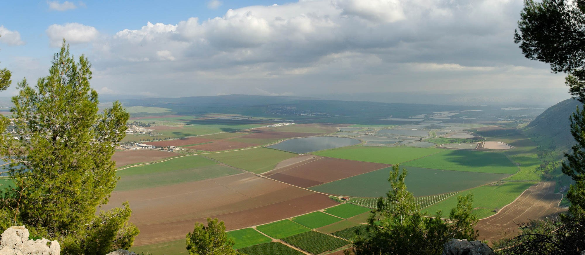

*Gospel Backgrounds* Lesson 36 is titled "Between Samaria and Galilee," and is taken from Luke 17:11 where we are told Jesus is making his way up to Jerusalem for His final passover and passes between Samaria and Galilee.  The video will explore the geography of the region know as the Harod Valley, where many scholars believe this episode took place.

The central story is that of Jesus healing ten lepers.  While all ten were healed, only one, a Samaritan, returned to give thanks and praise to Jesus.  In that day, most Jews had a dim view of Samaritans as evidenced by the three stories where Samaritans are featured prominently:

1. The Woman at the Well
2. The parable of the Good Samaritan
3. The Ten Lepers

The lesson for us is if even a Samaritan has enough heart to give thanks, how much more should we, as followers/disciples/talmidim of Yeshua have a humble and thankful heart.

## Video


