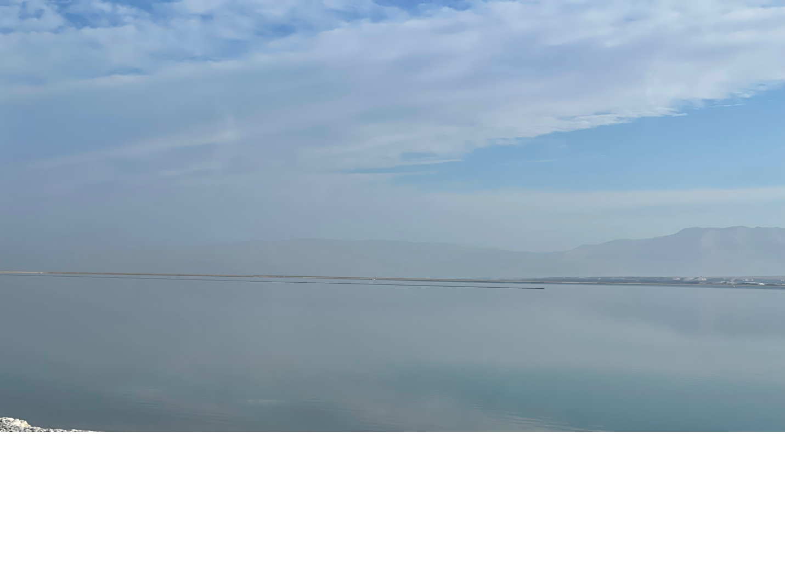
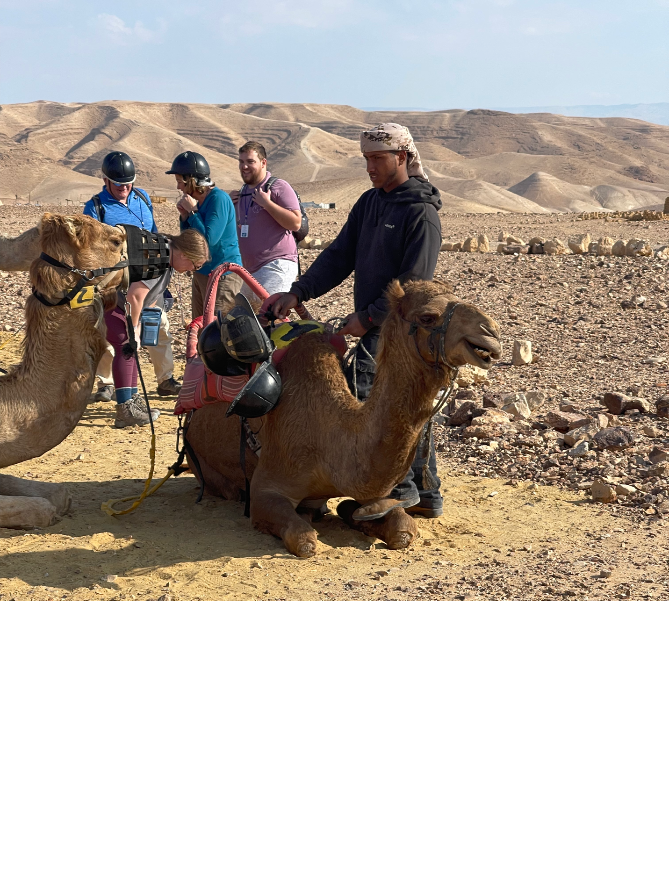
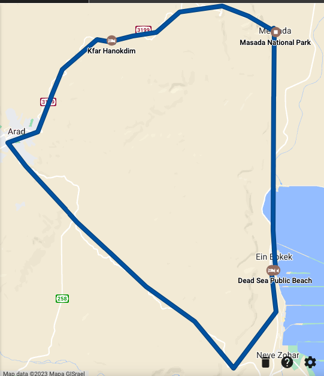

**Dead Sea Devotional**

Today was another full day of activities centered around the Dead Sea and Judean wilderness.  The general theme of the day was honor.    We started with a walk along the strand of the Dead Sea as the sun was rising over the **Moab** mountains.  Ronan  talked about the honor and faithfulness of Ruth the Moabitiess.  In the photo below, the Moab mountains are visible through the haze.

**Masada**

We then drove to  **Masada** . Masada means "fortress" in Hebrew.  It was a palace/fortress Herod built for himself that ended up being used by Jewish rebels.  After the Temple was burned in AD 70, the last 1000 holdouts fled here and made it their last stand.  It holds the same symbolism as the Alamo does in Texas history.  As the Romans were about to storm the top of the fortress, Josephus records that 10 men were tasked with killing their friend's and family and burning/destroying anything of value.  This was a better outcome in their view than being subject to Roman punishment.  Finally the last man standing fell on his sword and when the Romans scaled the wall.  We toured the historic site and learned a lot about 1st century life. As we exited, we walked down a path that parallels the Roman siege ramp, where the Romans breached the walls to find no booty to plunder.

On the drive from Masada, we learned about the geographic and geologic distinctions among the three words that get translated into English as "desert" or "wilderness."  Bmidbar, which is also the name of the book of Numbers in the Hebrew Bible is relatively fertile with shade and water available.  The next type, Tsiya, has no food or shelter.  What happened was villages sprang up about a day's journey apart.  The third type is Yeshimon.  In this type there truly is nothing for days.  Grumbling while in a Tsiyo or Yehimon would be more understandible, but the Israelites grumbled in the Bmidbar.

**Kfar Hanokdim**

We then traveled to a location called **Kfar Hanokdim,** which is a recreated Bedouin village and it is great example of Jews and Arabs working together.  A Jewish man wanted to preserve the hospitality culture that he believed his people have lost (and how much more have WE lost it in the west?), so he approached a group of Arab bedouins who were still living that lifestyle about creating a living museum.   My roommate Jeremy was selected to get 10 sheep from point A to point B about 50 feet away.  It was virtually impossible.  The lessons are certainly there for folks in leadership, but also it was a reminder that we are the stubborn sheep prone to wandering from our Shepherd. We did get to ride camels also. My camel is pictured below.  I'm not sure how to interpret his facial expession.

This set up the main discussion on Abraham and Hospitality in Genesis 18-19.  I recorded a brief video devo here:

\[youtube url="[<u>https://youtu.be/gPqCrqMDyXM</u>](https://youtu.be/gPqCrqMDyXM)"\]

**Tel Arad**

Because of time constraints, we were not able to get to Tel Arad, which was a location I had really wanted to see.  One thing about traveling here is "blessed are the flexible."  In the bus, we received a fantastic teaching on the history and application of Arad.  It was a place that had a nearly identical replica of the Jerusalem temple.  The first problem is what's another temple doing outside of Jerusalem and what are Jews doing worshipping there?  It gets worse.  On one pillar there was a dedication inscribed "to YHWH and his Asherah."   Asherah is a pagan fertility goddess.  So we're forced to ask "what in the world was going on here?"  After we're done pointing fingers at those dishonoring God, we can't forget to look in the mirror.  What are things we are worshipping alongside of God and bringing dishonor to Him?  What stories do our purchases,  video streaming queues, and internet histories tell?

**Dead Sea Float**

We ended the day with a dip in the **Dead Sea** - The salinity is about 10x that in oceans, which makes it impossible to sink.  The mineral content means the water is also poisonous to drink. Many claim healing properties from the water and mud from the lake's floor, so it's a tradition to "mud up" before a dip.  This reminded me of a contrast to living water versus deadly water.  Again, back to our bank accounts and netflix queues: might we actually be ingesting poison water by the things we take in?

Here is a brief video of me covered in mud talking about living water! \[youtube url="[<u>https://youtu.be/vb6lfETOmWY</u>](https://youtu.be/vb6lfETOmWY)"\]

So it was a day filled with great lessons and an exponentially deeper understanding of God's word.

Today's route from Google Maps (starting and ending at the Dead Sea public beach).

