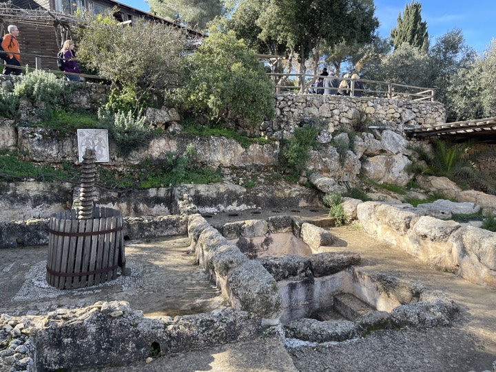
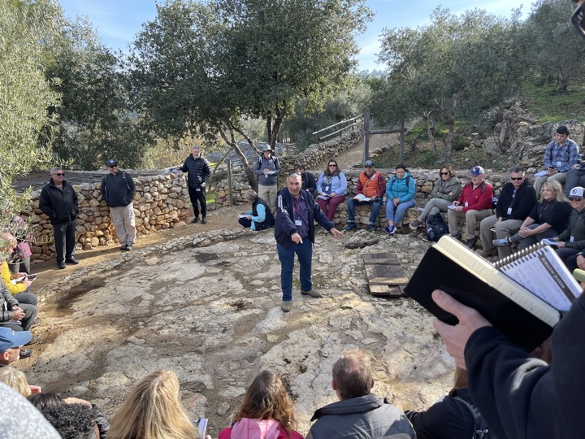
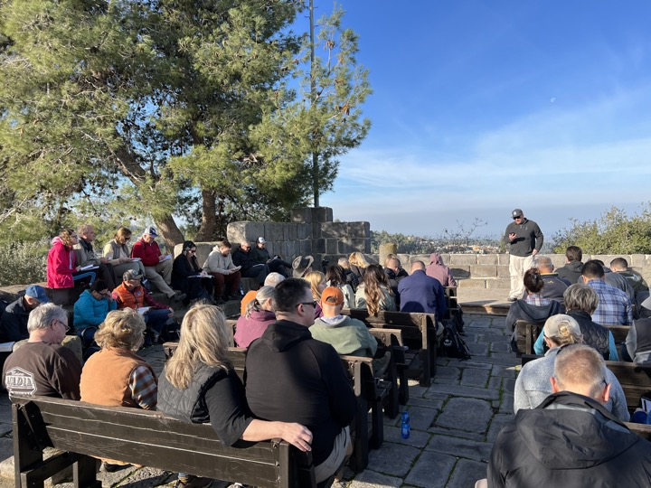
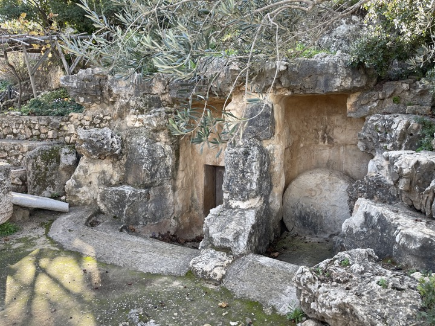

Yad Hashmonah Lesson 1/25/23: 


Often, the people and the places in the Bible can seem distant. After all, they were written thousands of years ago in a place that, for most of us, is thousands of miles away. _Yad Hashamonah_ is a recreated Biblical Village that helps us view our Bible in the proper context.  A place like this reminds us that the Bible describes real people and events that actually happened, and more importantly, God cares about them.  Yad Hashmonah teaches us that our great God who created the universe is still interested in the minor details of your life and mine. 

In our January 2023 trip, we studied Deuteronomy 8.  God desires a "good land" and blessing for His people.  He only asks for our obedience, which as we know is easier said than done.  While not a historical biblical site, the working village (called a *moshav*) contains historically accurate reproductions of a synagogue, a winepress, a watchtower, a threshing floor, olive presses and burial caves. The garden includes olive trees, grape vines, biblical herbs such as hyssop, and a wheat field. When we read about these things, which are quite frequent in the Bible, our minds immediately can place three-dimensional objects on top of the two-dimensional text.

#### Deuteronomy 8:7-14

>“For the LORD your God is bringing you into a good land, a land of streams of water, of fountains and springs, flowing out in valleys and hills; a land of wheat and barley, of vines, fig trees, and pomegranates, a land of olive oil and honey; a land where you will eat food without shortage, in which you will not lack anything; a land whose stones are iron, and out of whose hills you can dig copper. “When you have eaten and are satisfied, you shall bless the LORD your God for the good land which He has given you. “Be careful that you do not forget the LORD your God by failing to keep His commandments, His ordinances, and His statutes which I am commanding you today; otherwise, when you eat and are satisfied, and you build good houses and live in them, and when your herds and your flocks increase, and your silver and gold increase, and everything that you have increases, then your heart will become proud and you will forget the LORD your God who brought you out of the land of Egypt, out of the house of slavery."

#### The meaning of Yad HaShmonah
“Yad Hashmona” means Memorial to the Eight. The name was given by the Finnish founding members in memory of the eight Jewish refugees, who escaped in 1938 from Austria to Finland, and who were handed over by the Finns to the Nazi Gestapo in November 1942. The Finnish founders wished to somehow atone, on behalf of the Finnish people, for handing over the eight Jews to the Nazis. They viewed their contribution to developing the Land of Israel as an act of restoration and forgiveness.

#### Winepress:

>Matthew 21:33 “Hear another parable. There was a master of a house who planted a vineyard and put a fence around it and dug a winepress in it and built a tower and leased it to tenants, and went into another country. 

#### Threshing floor:

>Ruth 3:14 So she lay at his feet until morning, and got up before one person could recognize another; and he said, “Do not let it be known that the woman came to the threshing floor.”

#### Synagogue

>Luke 4:16 And He came to Nazareth, where He had been brought up; and as was His custom, He entered the synagogue on the Sabbath, and stood up to read.

#### Rolling stone tomb: 

>Matthew 28:1-2 Now after the Sabbath, as it began to dawn toward the first day of the week, Mary Magdalene and the other Mary came to look at the tomb. [2] And behold, a severe earthquake had occurred, for an angel of the Lord descended from heaven and came and rolled away the stone, and sat upon it.

 

 