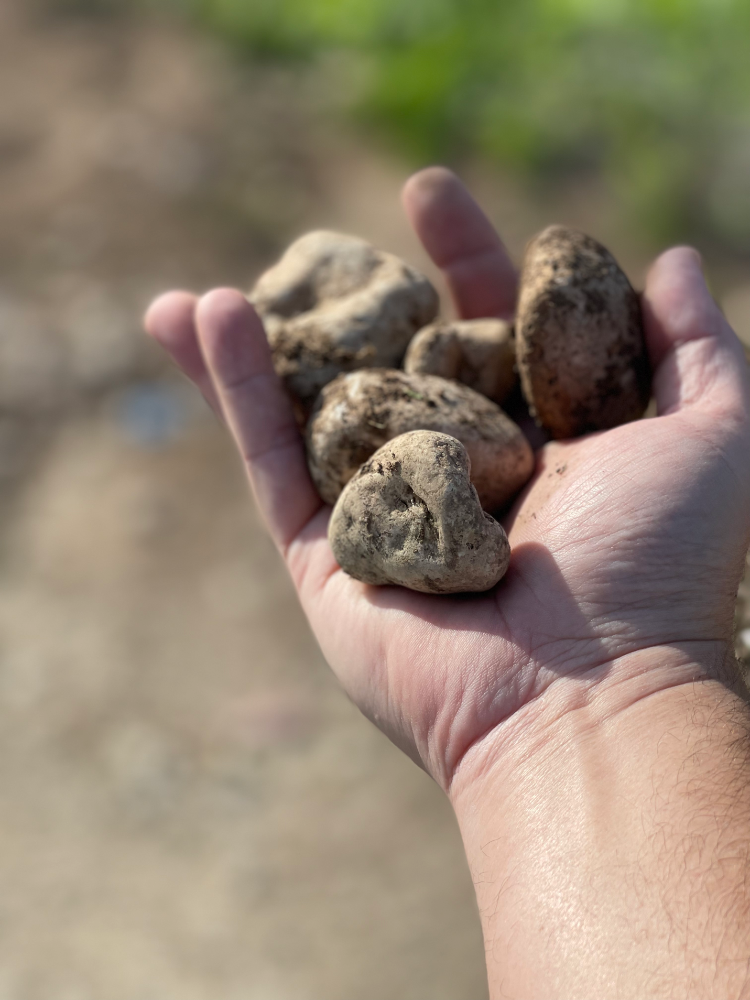
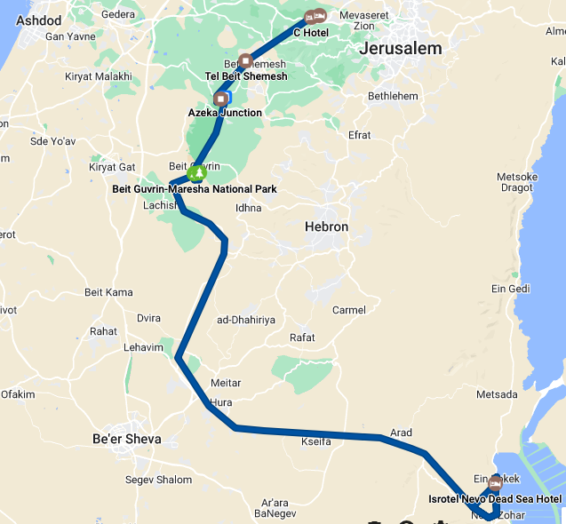

## Compromising – January 11, 2023

Today was especially exciting because, although this is not my first time in Israel, every site we visited was one I'd not seen before.  The theme of the day was compromising (Samson at Beth Shemesh) vs. being faithful (David v. Goliath at the Valley of Elah).

## Related Devotionals:

Azekah: 
Bet Guvrin: 

## Yad HaShmonah

We began the day by visiting Yad HaShmonah biblical garden.  The first thing our guide Ronan pointed it is that in the Bible, a garden has nothing to do with flowers.   It revolves around the seven spices of Deuteronomy 8: wheat, barley, grapes, figs, pomegranates, olives, and dates.  There is also a replica watchtower, synagogue, and rolling stone tomb.  In general, we learned all about life in ancient Israel.  This is very near the area of Kiryat Jearim where we recounted the saga of the Ark's capture and subsequent return by the Philistines in 1st Samuel 4-7.  The story began by the Israelites' going into battle without God.  Then instead of calling upon God the way Joshua and Moses did, they thought all they needed was the Ark, which was basically supposed to be a good luck charm of sorts.  It's a great story full of geographic references and, more importantly, personal application.

## Beth Shemesh 

We next moved just over the hill to Beth Shemesh and the Sorek valley, which is the setting of one of the more famous compromisers, Samson.  *Almost* every location referenced in Judges 13-16 is visible from Beth Shemesh and almost every act of Samson involves some form of compromise.  Yet, there he is in Hebrews 11.  That should give all of us hope!

Also at Beth Shemesh was an example of an ancient cistern. Pastor Randy then had us read Jeremiah 38 where Jeremiah was thrown into a muddy cistern.  As we were standing in a slightly muddy cistern, the passage came to life.  The photo below is looking up at the roof with the opening.  The cave was completely dark without flashlights.  Other references to being thrown into or lifted out of a pit such as Psalm 40 and *possibly* Jesus before Caiaphas also came to mind (in what could be Caiaphas’ house, they found a dungeon/pit, where possibly prisoners were kept.)

## Azekah 

From there it was to Azekah and the story of David and Goliath.  Azekah is a hill overlooking the valley.  We could see the hills where 1 Samuel 17 records the Philistine and Israelite armies, and of course the valley itself, where we stopped to gather 5 smooth stones from the brook just as David did.  On this day, David did not compromise.  Of the many directions Pastor Rich could have with this wonderful story, he focused on David as the unlikely savior of Israel and how Jesus is also unlikely.  He's not the Hero you're looking for.     

Here is a quick devotional I recorded \[youtube url="[<u>https://www.youtube.com/watch?v=U2QqSph7j7Q</u>](https://www.youtube.com/watch?v=U2QqSph7j7Q)"\].  We also discussed some reasons from archeology we can have even more confidence in the biblical account of David and Solomon.

## Bet Guvrin

We concluded the day with a visit to Bet Guvrin, known in Old Testament times as Mareshah.  This is the home of Micah the prophet.  In Micah 6, God calls the hills around Mareshah to be the jury as he presents his case.   Here is another brief devotional: \[youtube url="[<u>https://www.youtube.com/watch?v=zqSC8LS1KbI</u>](https://www.youtube.com/watch?v=zqSC8LS1KbI)"\]

We then took a beautiful sunset/dusk drive through the Negev desert and Judean wilderness on our way to the hotel at the Dead Sea.  Here is our route according to Google.

More tomorrow!
