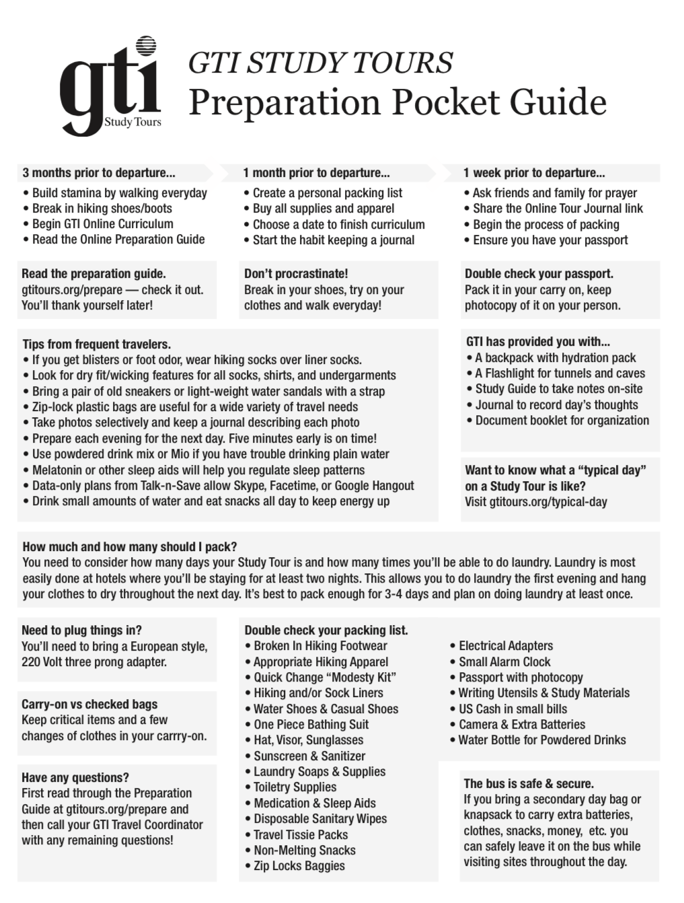

# Preparing – January 3, 2023

*"Walk about Zion, go around her, count her towers, consider well her rampart, view her citadels, that you may tell of them to the next generation. For this God is our God forever and ever; He will be our guide even to the end." - Psalm 48:12-14*

Next Monday night, I will be on a plane to Istanbul (not Constantinople).  From there, on Tuesday afternoon, I will connect to Tel Aviv to begin our tour on Wednesday the 11th.

I'm going with a group of pastors and other Christian educators with a company called GTI tours.  GTI has been running tours since 1992. This tour is unique in that it will be heavier on teaching than a typical tour (in fact, it might be on par with a seminary-level course). 

The thought is that the folks on this tour will one-day lead their own tours. Leading tours has been a dream of mine for over 10 years and I'm patiently waiting for God to open doors for all of us to go.  Since we just studied Genesis 16, I will certainly be waiting on His timing and doing my best never to get in front of God!

I have been to Israel twice before (2010 and 2013), but the opportunity GTI presented -- an intensive "train the trainer" type of experience at about 1/2 the price of a normal tour -- was too good to pass up.

This quote sums up my passion for the Land:

*“I found the country \[i.e., Palestine, in 1877\] and the people pretty much as I expected, but I trust I understand both better than before. My faith in the Bible has not been shaken but confirmed. Many facts and scenes, which seem to float ghost-like in the clouds to a distant reader, assume flesh and blood in the land of their birth. There is a marvelous correspondence between the Land and the Book. The Bible is the best handbook for the Holy Land, and the Holy Land is the best commentary on the Bible.” Philip Schaff (1813-1893)*

GTI has done an excellent job with preparation, including packing lists, a pre-trip course on history and geography, and a couple of Zoom Q&A calls.   We have Bible reading and journaling assignments, including several chapters to read on the long flight.

I've prayed to be ready to receive what God wants to give. 

My goals are twofold:

1.  Bring the land and the lessons back home to folks who may never be able to travel.

2.  Become a resource who can help meet the needs of those who *can* go someday.  

Admittedly, these can be “Martha" type focuses.  I relate to Martha more than Mary.  I think I lot of us do. I certainly want to be a "Mary" also and sit at our Rabbi's feet in His exceptional Land.

I will try to post a quick word and maybe a few photos and videos each day (as connectivity allows).  I covet everyone's prayers for both me overseas and Sarah at home while I'm away.

Chris

 

