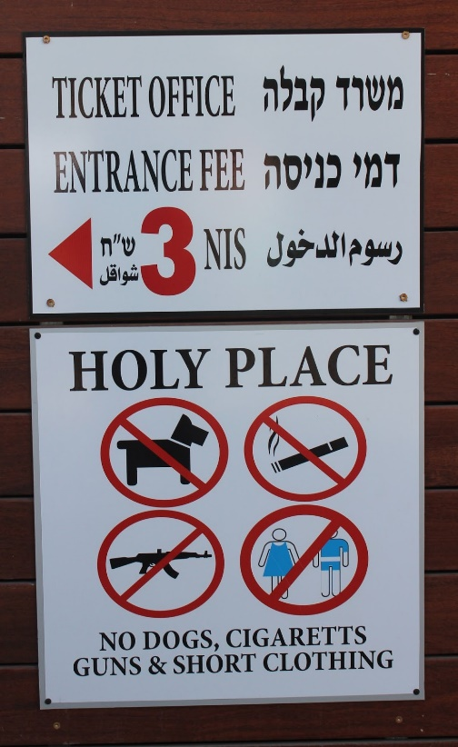
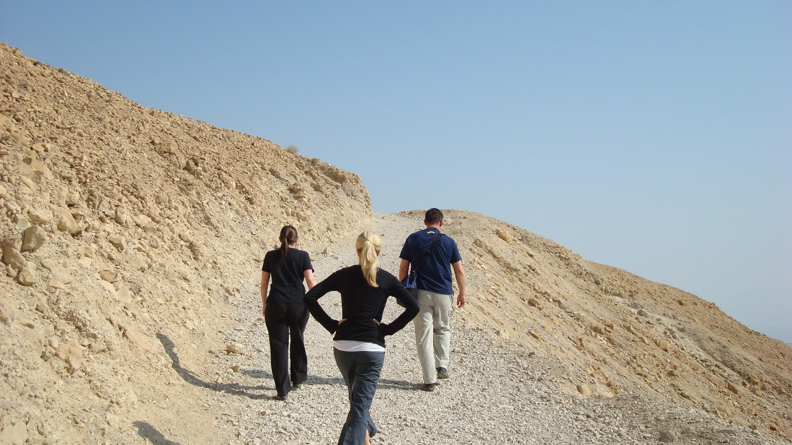
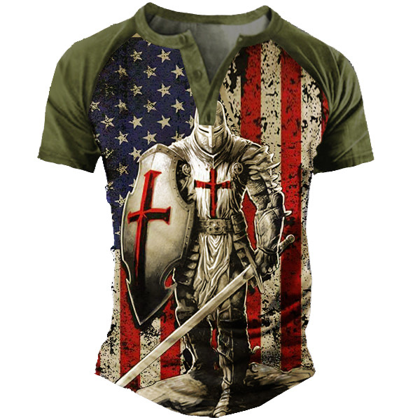

## CLOTHING

(Links to examples are **Bolded**)

>   Comfort before fashion is the key to touring in Israel. Casual, travel-ready clothing is all you will need with a few specific guidelines (see "Holy sites" below). The weather in late spring will be warm, like Texas. You will want to pack lightly, wrinkle-free, and be ready to rewear outfits. Simplicity is the key.

### What CAN you bring?

-   One checked bag up to 50 lbs, MAX (airline restriction), plus one personal carry-on, such as a backpack

### What SHOULD you bring?

-   Just because you can doesn’t mean you should!
-   "Less is more" - the simpler you can make your life, the more time you will have for HIM

### General

*(Note: links to Amazon below are for illustrative purposes only - we are not necessarily recommending these exact products)*

-   Lightweight and wrinkle-free
-   Columbia (outlet store in Allen), REI (store in Plano), Magellan, North Face, Outdoor Research, and other hiking outfitters have practical travel clothes that have moisture-wicking and SPF protection
-   Think "*Function over fashion*" - plan to wear and re-wear outfits.
    -   If your clothes for two weeks in Israel can't fit in a 21" roll-a-board, you've probably overpacked.
        -   Note - Whatever size suitcase you bring, consider allowing extra room to bring back things (gifts and souvenirs) purchased while in Israel
-   For dinners, you might consider bringing one "casual dressy" outfit - (something other than jeans) but this is your option. Wearing your touring clothes is just fine.

{{\< callout note\>}}

**PRO TIP: Do Laundry in hotel sinks**

Laundry availability is inconsistent. Bring powdered detergent, a 1-3/8" sink plug, a travel clothesline, and a few clothespins to wash/rinse your clothes in the hotel sink and leave them to dry the next day

{{\< /callout \>}}

### Holy Sites

-   Capernaum and a few sites in Jerusalem (including the Temple Mount, Western Wall, and Holy Sepulcher) have dress codes enforced - Bare legs (knees and above) and shoulders are inappropriate
    -   For women, a mid-calf lightweight elastic waist skirt, lightweight jumper or large cotton scarf to wrap around shorts plus a scarf or shawl to cover bare shoulders. Capri pants are fine.
    -   For men, a pair of pants with [**zip on/off legs**](https://www.amazon.com/Columbia-Mens-Convertible-Pant-Small/dp/B0089PWWZO/ref=sr_1_2?ie=UTF8&qid=1494461753&sr=8-2&keywords=columbia+pfg+convertible+pants+mens) would be helpful for an easy transition when legs must be covered
-   Guides will let us know in advance when a modest dress code is required

### 

### Hat

-   [**Wide-brimmed**](https://www.amazon.com/Columbia-Bora-Booney-Hats-Sage/dp/B0058YU1OI/ref=sr_1_1?ie=UTF8&qid=1494461519&sr=8-1&keywords=columbia+hat) is a must!
-   Ballcaps do not cover the ears & neck; visors cover even less.
-   Dehydration is more common if the head is uncovered
-   We strongly recommend a hat with a strap as it can get windy
-   Head must be COVERED at Western Wall and other Jewish holy sites
-   Head must be UNCOVERED for the Holy Sepulcher
    -   And the Pope wears a Jewish kippah; go figure...

### Shirts

-   [**Lightweight, hiking/fishing, moisture-wicking**](https://www.amazon.com/s/ref=nb_sb_noss_1?url=search-alias%3Daps&field-keywords=magellan+shirts&rh=i%3Aaps%2Ck%3Amagellan+shirts) or knit shirts that dry quickly. You might want a long sleeve if you are sun-sensitive or prefer more coverage
-   Women - as above or cotton or silk shirt or blouse (one that covers the shoulder down to the middle of your upper arm if you want to be good to go for Holy sites). Note - women and girls should not have exposed midriffs, bring tank tops, blouses with spaghetti straps, or short-shorts as they are too immodest

{{\< callout note\>}}

**PRO TIP:  Darker colors are best for pictures**

Other than the well-watered north, most of Israel's terrain and buildings are this tan/sand color. Outdoor travel clothing also tends to be tan-colored. Notice how the dark colors stand out in this photo. Now, imagine if the man was also wearing a tan-colored shirt in addition to his tan pants. He would almost be invisible! Wear contrasting colors!

{{\< /callout \>}}

### Skirts/shorts

-   Lightweight fabric shorts which dry quickly (i.e. Nylon, hiking type)
-   Skirts that cover the knees work as well
-   Given the time of year, long pants are likely to be uncomfortable. Suggest the "[**convertible**](https://www.columbia.com/search?q=convertible)" variety for Holy sites.
-   Modest swimming suit for the Dead Sea (and possible Baptism or other limited swimming opportunities).

### Footwear

-   Short of forgetting or losing your passport, shoes need to be your \#1 priority. They can make or break your trip. Blisters are no fun.
-   [**Moisture-wicking socks**](https://www.amazon.com/s?k=moisture+wicking+socks&crid=2VJTYNYFR9NSF&sprefix=moisture+wicking+socks%2Caps%2C526&ref=nb_sb_noss_2) are highly recommended. Recommend Smart Wool or something similar. Cotton is more susceptible to fostering blisters.
-   Shoes should have solid ankle support – break in extremely well before arrival
-   A lot of folks love the [**Chaco style**](https://www.amazon.com/gp/aw/s/ref=is_s?k=chaco+sandals) sandals.
-   Otherwise good walking shoes or [**hiking shoes/sandals**](https://www.amazon.com/s/ref=nb_sb_noss_2?url=search-alias%3Daps&field-keywords=hiking+shoes)
    -   Water shoes are fine for Hezekiah's tunnel or the dead sea but don't use these for other walking
    -   We Don't recommend flip-flops for walking because of the chances of turning an ankle on uneven terrain
    -   Don’t forget sunscreen if the top of your foot is going to be exposed
-   Sandals or other comfortable casual shoes for evenings

{{\< callout warning \>}}

**PRO TIP: Break-in new shoes before arrival**

A blister would be miserable with all of the walking we'll be doing

{{\< /callout \>}}

### Jackets

If you like to wear a jacket or sweatshirt in Texas in late spring, then you might want to bring one to Israel. Other than the airplane trip, most of us will not need one! The chance of rain between May and September is statistically zero, but with God, we never say never! This is up to you. We might advise a travel windbreaker as opposed to a bulky sweatshirt or jacket.

### Other Clothing items

-   Durable high-quality sunglasses are a must! You may want a neck cord.
-   [**Evaporative Cooling Towel** ](https://www.amazon.com/Ergodyne-Chill-Its-6602-Evaporative-Cooling/dp/B001B5I57I/ref=sr_1_1?ie=UTF8&qid=1494462214&sr=8-1&keywords=ergodyne+chill)**(a** popular brand is Ergodyne) is becoming popular for participants to bring - even more practical is the "Buff" (like on Survivor) that convert from a neck-wrap to a beanie (you can also use it as a mask if Covid breaks out again)
-   If you are prone to calf swelling on a long flight, or if you think you might be prone, recommend [**compression stockings**](https://www.amazon.com/Kendall-T-E-D-Length-Embolism-Stockings/dp/B0015TGAVS/ref=sr_1_2_a_it?ie=UTF8&qid=1494462441&sr=8-2&keywords=ted+hose+compression+stockings) for the flight

{{\< callout warning \>}}

### Clothing NOT to bring

-   Excessive pairs of **anything** (shoes, shorts, underwear) - just bring 2 or 3 outfits and wear them over and over again
-   Clothing that is prone to wrinkling (unless you like that look)
    -   Remember simplicity is the key
    -   You *could* bring an outfit that requires ironing, but then you'd have to bring a travel iron (Irons are not standard in Israeli hotels)
    -   It is better to just bring wrinkle-free clothes
-   Things that will not dry overnight
-   Clothing with American, political, or Christian symbols/slogans is highly discouraged.
    -   You are not being ashamed or unpatriotic - you are loving your neighbors and being a gracious and polite guest
    -   This type of shirt is definitely a no-go! The Crusades are still a sore subject with Muslims and Jews (ask me why sometimes)

        

{{\< /callout \>}}
