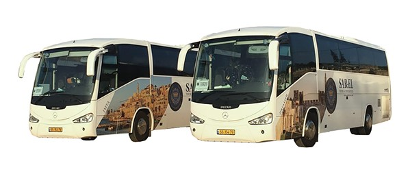

Itinerary

Note we may add or rearrange the daily itinerary to maximize our experience in the Holy Land so that it as fascinating, thought-provoking, and extraordinary as possible. We can't stress enough to be flexible!

| **Day**  | **Date** | **Proposed Itinerary**                                                                                                                                                                                                                                           | **Hotels**                                                                                                                                                                                                                                                                                                                                                                                                                                                                                                       |
|----------|----------|------------------------------------------------------------------------------------------------------------------------------------------------------------------------------------------------------------------------------------------------------------------|------------------------------------------------------------------------------------------------------------------------------------------------------------------------------------------------------------------------------------------------------------------------------------------------------------------------------------------------------------------------------------------------------------------------------------------------------------------------------------------------------------------|
| Day 0    | TBD      | Depart DFW overnight flight to TLV Ben Gurion Airport                                                                                                                                                                                                            | Night on Plane                                                                                                                                                                                                                                                                                                                                                                                                                                                                                                   |
| Day 1    |          | Arrival in Tel Aviv late afternoon, transfer to hotel; introductory meeting                                                                                                                                                                                      | Tel Aviv/Netanya                                                                                                                                                                                                                                                                                                                                                                                                                                                                                                 |
| Day 2    |          | Caesarea Maritima, Mt. Carmel, Megiddo, Nazareth Village                                                                                                                                                                                                         | Galilee                                                                                                                                                                                                                                                                                                                                                                                                                                                                                                          |
| Day 3    |          | Tel Dan (border tour?), Caesarea Philippi, Mt. Bental, eastern shore (Kursi/pigs, Bethsaida?)                                                                                                                                                                    | Galilee                                                                                                                                                                                                                                                                                                                                                                                                                                                                                                          |
| Day 4    |          | Sea of Galilee sites: Daniel Carmel Boat, Capernaum, Mt. of Beatitudes, Tabgha; Baptism/Rededication (Yardenit or Sea of Galilee)                                                                                                                                | Galilee                                                                                                                                                                                                                                                                                                                                                                                                                                                                                                          |
| Day 5    |          | Tel Jezreel/Harod Springs, Beit Shean, Jericho, Dead Sea float                                                                                                                                                                                                   | Dead sea                                                                                                                                                                                                                                                                                                                                                                                                                                                                                                         |
| Day 6    |          | Ein Gedi, Masada, Old Jericho Road, Mt of Olives overlook                                                                                                                                                                                                        | Jerusalem                                                                                                                                                                                                                                                                                                                                                                                                                                                                                                        |
| Day 7    |          | Knesset Menorrah, Bible Lands Museum or Israel Museum  Yad Vashem (Holocaust Museum)                                                                                                                                                                             | Jerusalem                                                                                                                                                                                                                                                                                                                                                                                                                                                                                                        |
| Day 8    |          | Elah Valley, Tel Azeka, Tel Beth Shemesh, Bethlehem overlook                                                                                                                                                                                                     | Jerusalem                                                                                                                                                                                                                                                                                                                                                                                                                                                                                                        |
| Day 9    |          | Jerusalem Jewish sites: Temple Mount City of David (Jeremiah's Cistern, Hezekiah's Tunnel, Pool of Siloam), Southern Steps, Jewish Quarter                                                                                                                       | Jerusalem                                                                                                                                                                                                                                                                                                                                                                                                                                                                                                        |
| Day 10   |          | Jerusalem Christian sites: Mount of Olives, Palm Sunday Road, Garden of Gethsemane, Stations of the Cross, Church of the Holy Sepulcher, Pools of Bethesda, Mt. Zion, Caiaphas' House, Garden Tomb Farewell dinner Bus to the airport for late evening departure | Night on Plane                                                                                                                                                                                                                                                                                                                                                                                                                                                                                                   |
| Days 11+ |          | For anyone interested, Sarah and I are planning to stay for a few days in Jerusalem. We will be in the city on our own and see some extra sights/activities not included in the main tour.                                                                       | The cost of lodging, food, and activities will be "pay as you go." [Abraham's Hostel](https://www.abrahamhostels.com/jerusalem/) is an inexpensive yet fun hostel in the center of West Jerusalem.  The hostel also [offers tours](https://www.abrahamtours.com/theme/tours-from-jerusalem/) to places like Bethlehem, Hebron, and other "west bank" sites, as well as "dual narrative" (Jewish/Muslim) tours of Jerusalem. The airport is a 20-minute train ride. Trains run until midnight except on Shabbat.  |
|          |          |                                                                                                                                                                                                                                                                  |                                                                                                                                                                                                                                                                                                                                                                                                                                                                                                                  |
