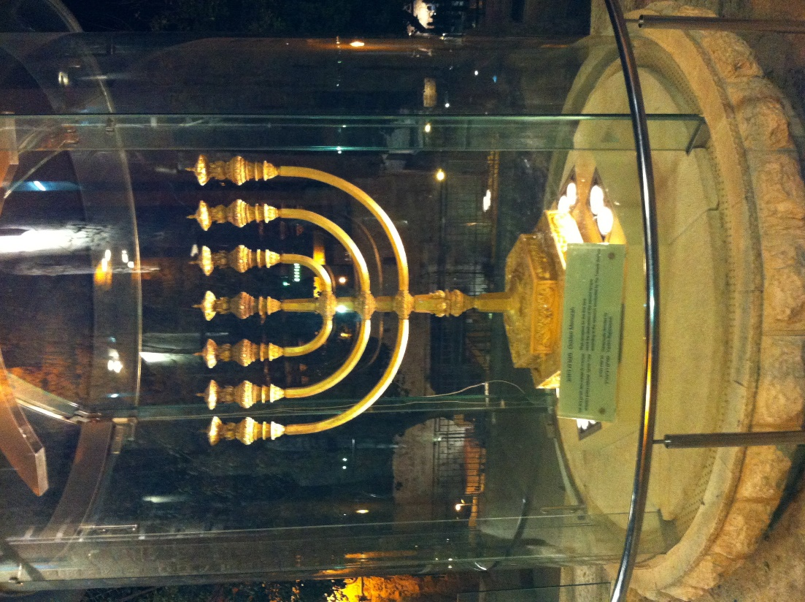

Revelation Backgrounds lesson 4 is titled, "One Like a Son of Man" based on John's description of the divine being he sees.  Note that he does not say this is Jesus speaking directly.  In fact, we know from verses 1:1 and 22:8 that it is NOT Jesus speaking to John but an Angel.  Nonetheless, the depiction is assuredly that of Jesus Messiah in His glorified state.

For our background, we will read Daniel chapters 7 and 10 along with Revelation 1 and note the consistency of idioms used throughout the Bible, Old and New Testaments, specifically the descriptions of the "one like a Son of Man" and the "Ancient of Days".  For this reason, we like to say that our Bible is 66 separate books, but one integrated message.

We ended last lesson with John hearing a great voice behind him.  Now here in verse 12, we see John turning to look and he sees the gold seven branched Menorah.  This menorah probably looked much like the one in the picture. Next we learn that the one like a Son of Man was in the midst of the Menorah and later we will see that each branch, each light, is one of the seven congregations  A Menorah is one object with seven branches, which draws images of John 15. Jesus said, "I am the vine, you are the branches."  We are supposed to be the vessels through which God's light shines.  Jesus also said in John 15 "abide in Me."  We must remain connected to the source.  A Menorah is a great picture of Jesus.

Next we have a description of the person John saw, which is nearly identical to Daniel's visions. This description bears some resemblance to the High Priest carrying out his duties in the Tabernacle.  One commentator said, "The garments are highly symbolic, showing that Jesus is the heavenly priest, fully prepared and qualified to carry out His duties."

In verse 19, we will look at this Greek phrase μετα ταυτα (meta tauta), which is often translated as "after these things."  The phrase appears exactly ten times in Revelation and acts as a signpost to let us know where we are.  In what is called gematria, certain numbers that reappear throughout the Bible appear to be associated with specific themes.  We've talked previously how the number seven indicates perfection or completeness.  All this means is that scholars have looked at where seven (or groups/multiples of seven) appear and they have noticed the theme of completeness.  Along these lines, 10 indicates divine order.  The most obvious examples are the Ten Commandments and the Ten plagues.  There were also ten generations from Adam to Noah, then the Flood came.  Meta Tauta will signify an additional stage of God setting things in order.
 
 The lesson will conclude with a side-by-side comparison of Revelation 1 and Daniel 10.  This demonstrates that our 66 books we call the Bible is ONE integrated message and it consistent from Genesis to Revelation.  There was no "plan B," where God decided the Old Testament was irrelevant (God forbid!). Jesus Himself says this.  Not until all things have been fulfilled will one jot or tittle pass away from the Torah (Mat 5:18).

## Read/Listen to the portions

Also read Daniel 7 and Daniel 10 straight through.

 

| **Revelation 1:12-20**                                                                                                                                                                                                                           | **References**                                                                                                                                                                                                                                                                                                                                                                                                                                                                                                                                                                                                                                                                                                                                                                                   |
|--------------------------------------------------------------------------------------------------------------------------------------------------------------------------------------------------------------------------------------------|--------------------------------------------------------------------------------------------------------------------------------------------------------------------------------------------------------------------------------------------------------------------------------------------------------------------------------------------------------------------------------------------------------------------------------------------------------------------------------------------------------------------------------------------------------------------------------------------------------------------------------------------------------------------------------------------------------------------------------------------------------------------------------------------------|
| 12. I turned around to see who was speaking to me; and when I had turned, I saw seven gold menorahs;                                                                                                                                       | Exodus 37:23 And he made its seven lamps and its tongs and its trays of pure gold.  Zec 4:2 And he said to me, “What do you see?” I said, “I see, and behold, a lampstand all of gold, with a bowl on the top of it, and seven lamps on it, with seven lips on each of the lamps that are on the top of it.                                                                                                                                                                                                                                                                                                                                                                                                                                                                                       |
| 13. and among the menorahs was someone like a Son of Man, wearing a robe down to his feet and a gold band around his chest                                                                                                                 | Exo 28:4 These are the garments that they shall make: a breast piece, an ephod, a robe, a coat of checker work, a turban, and a sash. They shall make holy garments for Aaron your brother and his sons to serve me as priests.   Dan 7:13 “I saw in the night visions, and behold, with the clouds of heaven there came one like a son of man, and he came to the Ancient of Days and was presented before him.  Dan 10:5 I lifted up my eyes and looked, and behold, a man clothed in linen, with a belt of fine gold from Uphaz around his waist. Dan 10:16 And behold, one in the likeness of the children of man touched my lips. Then I opened my mouth and spoke. I said to him who stood before me, “O my lord, by reason of the vision pains have come upon me, and I retain no strength. |
| 14. His head and hair were as white as snow-white wool, his eyes like a fiery flame,                                                                                                                                                       | Dan 7:9 “As I looked, thrones were placed, and the Ancient of Days took his seat; his clothing was white as snow, and the hair of his head like pure wool; his throne was fiery flames; its wheels were burning fire.   Dan 10:6 His body was like beryl, his face like the appearance of lightning Mat 17:2 And he was transfigured before them, and his face shone like the sun, and his clothes became white as light.                                                                                                                                                                                                                                                                                                                                                                      |
| 15. his feet like burnished brass refined in a furnace, and his voice like the sound of rushing waters.                                                                                                                                    | Dan 10:6 … his arms and legs like the gleam of burnished bronze, and the sound of his words like the sound of a multitude.  Eze 1:7, 24 Their legs were straight, and the soles of their feet were like the sole of a calf’s foot. And they sparkled like burnished bronze.  24 And when they went, I heard the sound of their wings like the sound of many waters, like the sound of the Almighty, a sound of tumult like the sound of an army. When they stood still, they let down their wings.  Eze 43:2 And behold, the glory of the God of Israel was coming from the east. And the sound of his coming was like the sound of many waters, and the earth shone with his glory.                                                                                                               |
| 16. In his right hand he held seven stars, out of his mouth went a sharp double-edged sword, and his face was like the sun shining in full strength.                                                                                       | Jdg 5:31 “So may all your enemies perish, O LORD! But your friends be like the sun as he rises in his might.”  Isa 49:2 He made my mouth like a sharp sword; in the shadow of his hand he hid me; he made me a polished arrow; in his quiver he hid me away.  Heb 4:12 For the word of God is living and active, sharper than any two-edged sword, piercing to the division of soul and of spirit, of joints and of marrow, and discerning the thoughts and intentions of the heart                                                                                                                                                                                                                                                                                                                |
| 17. When I saw him, I fell down at his feet like a dead man. He placed his right hand upon me and said, "Don't be afraid! I am the First and the Last,                                                                                     | Dan 8:17-18 So he came near where I stood. And when he came, I was frightened and fell on my face. But he said to me, “Understand, O son of man, that the vision is for the time of the end.” 18 And when he had spoken to me, I fell into a deep sleep with my face to the ground. But he touched me and made me stand up.  Dan 10:9-10,12,15 followed by Dan 10:19 And he said, “O man greatly loved, fear not, peace be with you; be strong and of good courage.” And as he spoke to me, I was strengthened and said, “Let my lord speak, for you have strengthened me.”                                                                                                                                                                                                                       |
| 18. the Living One. I was dead, but look!—I am alive forever and ever! And I hold the keys to Death and Sh'ol.                                                                                                                             | Isa 25:8 He will swallow up death forever; and the Lord GOD will wipe away tears from all faces, and the reproach of his people he will take away from all the earth, for the LORD has spoken.   Hos 13:14 I shall ransom them from the power of Sheol; I shall redeem them from Death. O Death, where are your plagues? O Sheol, where is your sting?                                                                                                                                                                                                                                                                                                                                                                                                                                            |
| 19. So write down what you see, both what is now, and what will happen afterward.                                                                                                                                                          | Isa 30:8; Jer 30:2; Hab 2:2 (see Rev 1:11)                                                                                                                                                                                                                                                                                                                                                                                                                                                                                                                                                                                                                                                                                                                                                       |
| 20. Here is the secret meaning of the seven stars you saw in my right hand, and of the seven gold menorahs: the seven stars are the angels of the seven Messianic communities, and the seven menorahs are the seven Messianic communities. | Zech 4:2 And he said to me, “What do you see?” I said, “I see, and behold, a lampstand all of gold, with a bowl on the top of it, and seven lamps on it, with seven lips on each of the lamps that are on the top of it.                                                                                                                                                                                                                                                                                                                                                                                                                                                                                                                                                                        |

## Watch the video



## Study the context


